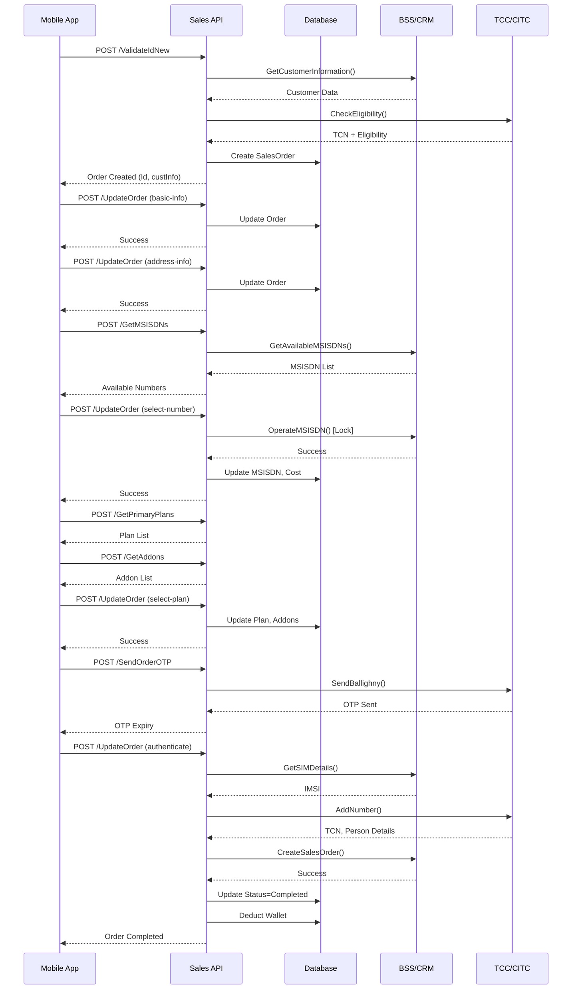
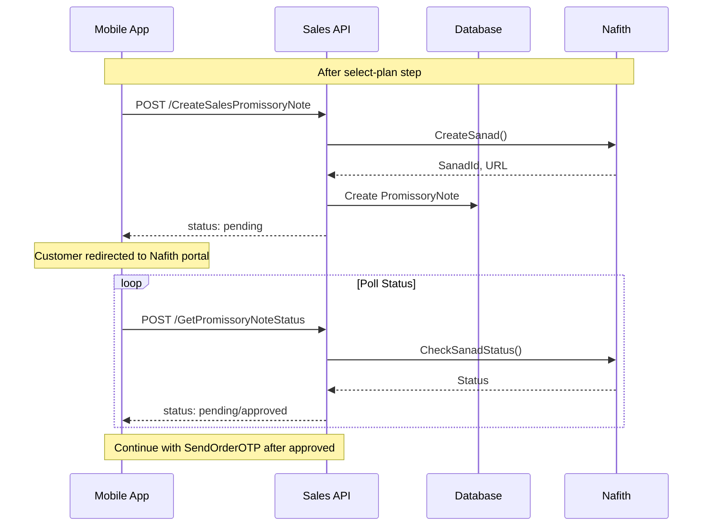
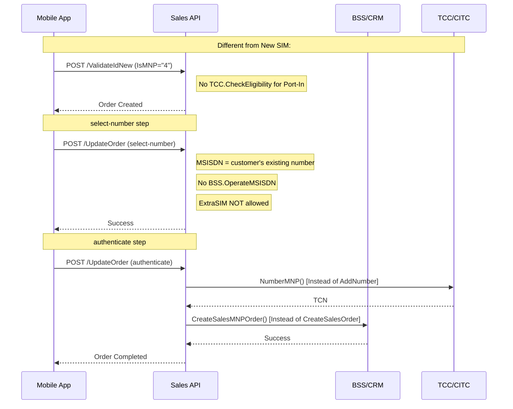

# API Flow & Endpoint Sequence Documentation
## Postpaid Call Line Activation (Physical SIM & eSIM)

**Version:** 1.0
**Date:** December 2024
**Purpose:** Complete API documentation for Java team re-implementation

---

## Table of Contents
1. [Overview](#1-overview)
2. [API Timeline & Sequence](#2-api-timeline--sequence)
3. [Detailed API Specifications](#3-detailed-api-specifications)
4. [Conditional APIs](#4-conditional-apis)
5. [External API Integrations](#5-external-api-integrations)
6. [API Dependency Matrix](#6-api-dependency-matrix)
7. [Sequence Diagrams](#7-sequence-diagrams)
8. [Error Handling](#8-error-handling)
9. [Code References](#9-code-references)

---

## 1. Overview

### 1.1 Activation Types Covered
| ActivationType Enum | Value | Description |
|---------------------|-------|-------------|
| `PostpaidNewSIM` | 3 | New Postpaid line with new MSISDN |
| `PostpaidPortIn` | 4 | Port-In from another operator |
| `PostpaidDataSIM` | 5 | Data-only SIM (MBB) |

**Code Reference:** [SalesOrder.cs:15-23](RedBullSalesPortal/RedBullSalesPortal.Web/Models/Tables/SalesOrder.cs#L15-L23)

### 1.2 System Architecture
```
┌─────────────────┐     ┌──────────────────┐     ┌─────────────────┐
│   Mobile App    │────▶│  Sales Portal    │────▶│  External APIs  │
│   (Flutter)     │     │  (ASP.NET Core)  │     │  (BSS/TCC/etc)  │
└─────────────────┘     └──────────────────┘     └─────────────────┘
                               │
                               ▼
                        ┌──────────────────┐
                        │   SQL Server DB  │
                        └──────────────────┘
```

### 1.3 Base URL & Authentication
- **Base URL:** `https://{host}/api/Sales/`
- **Authentication:** JWT Bearer Token
- **Header:** `Authorization: Bearer {token}`

---

## 2. API Timeline & Sequence

### 2.1 Complete Flow Timeline (Chronological Order)

```
PHASE 1: CUSTOMER VALIDATION
├── Step 1.1: POST /api/Sales/ValidateIdNew
│   └── Internal: Creates SalesOrder record (Status: New)
│   └── External: BSS.GetCustomerInformation()
│   └── External: TCC.CheckEligibility()

PHASE 2: ORDER CREATION
├── Step 2.1: POST /api/Sales/UpdateOrder (step: "basic-info")
│   └── Updates: FirstName, LastName, Email
│   └── Sets: Status = InProgress
│
├── Step 2.2: POST /api/Sales/UpdateOrder (step: "address-info")
│   └── Updates: OrderLat, OrderLng, OrderCity, OrderAddress
│
├── Step 2.3: POST /api/Sales/GetMSISDNs (or GetInitialMSISDNs)
│   └── External: BSS.GetAvailableMSISDNs()
│
├── Step 2.4: POST /api/Sales/UpdateOrder (step: "select-number")
│   └── Updates: MSISDN, MSISDNCost, IsMNP, MNPOperator
│   └── External: BSS.OperateMSISDN() [locks the number]
│   └── [CONDITIONAL] If ExtraSIM: BSS.GetDataMSISDN()
│
├── Step 2.5: POST /api/Sales/GetPrimaryPlans
│   └── Returns: Available plans for SubType=1 (Postpaid)
│
├── Step 2.6: POST /api/Sales/GetAddons
│   └── Returns: Available addons for selected plan
│
├── Step 2.7: POST /api/Sales/UpdateOrder (step: "select-plan")
│   └── Updates: PlanId, PlanName, Addons, PlanCost, AddonsCost

PHASE 3: PROMISSORY NOTE (Conditional - Vanity Numbers)
├── Step 3.1: POST /api/Sales/CreateSalesPromissoryNote
│   └── External: Nafith.CreateSanad()
│   └── Returns: SanadId, acceptance_url
│
├── Step 3.2: [Customer signs on Nafith portal]
│
├── Step 3.3: POST /api/Sales/GetPromissoryNoteStatus (polling)
│   └── External: Nafith.CheckSanadStatus()
│   └── Returns: status (pending/approved/rejected)

PHASE 4: OTP & AUTHENTICATION
├── Step 4.1: POST /api/Sales/SendOrderOTP
│   └── External (Postpaid): TCC.SendBallighny()
│   └── Returns: OTP sent to customer via Ballighny
│
├── Step 4.2: POST /api/Sales/UpdateOrder (step: "authenticate")
│   └── Validates: ICCID, FingerImage/IAMToken/OTP
│   └── External: BSS.GetSIMDetails() or BSS.PickESim()
│   └── External: TCC.AddNumber() or TCC.NumberMNP()
│   └── External: BSS.CreateSalesOrder() or BSS.CreateSalesMNPOrder()
│   └── Internal: Deducts from Wallet
│   └── Internal: Generates eContract
│   └── Sets: Status = Completed

PHASE 5: POST-ACTIVATION
├── Step 5.1: [Async] SMS Confirmation
│   └── External: SMSHelper.SendSMS() or TCC.SendBallighny()
│
├── Step 5.2: [Async] eInvoice Generation (ZATCA channels)
│   └── Internal: GenerateEInvoiceLocal()

PHASE 6: EXTRA SIM ACTIVATION (Conditional)
├── Step 6.1: [Background Task] ActivateExtraSIMRecords()
│   └── External: BSS.CreateExtraSIMOrder()
│   └── External: TCC.AddExtraSIM()
```

---

## 3. Detailed API Specifications

### 3.1 ValidateIdNew

**Endpoint:** `POST /api/Sales/ValidateIdNew`
**Authentication:** Required
**Code Reference:** [SalesAPIController.cs:922-1094](RedBullSalesPortal/RedBullSalesPortal.Web/Modules/SalesAPI/SalesAPIController.cs#L922-L1094)

#### Request Payload
```json
{
  "IdNumber": "1234567890",
  "IdType": 1,
  "Nationality": 113,
  "ContactNumber": "0512345678",
  "IsMNP": "3",
  "IsESim": "0"
}
```

| Field | Type | Required | Description |
|-------|------|----------|-------------|
| IdNumber | string | Yes | Saudi ID or Iqama number |
| IdType | int | Yes | 1=Citizen, 2=Resident, 3=Passport, etc. |
| Nationality | int | Yes | TCC Nationality code |
| ContactNumber | string | Yes | Contact phone number |
| IsMNP | string | Yes | Activation type: "3"=PostpaidNewSIM, "4"=PostpaidPortIn, "5"=PostpaidDataSIM |
| IsESim | string | No | "0"=Physical SIM, "1"=eSIM |

#### Response Payload (Success - 200 OK)
```json
{
  "custInfo": {
    "idNumber": "1234567890",
    "firstName": "Mohammed",
    "lastName": "Ahmed",
    "customerId": "CUST123456",
    "status": "Active",
    "email": "customer@email.com"
  },
  "tccEligibility": {
    "tcn": "e81e370a-c021-49ca-af46-62e4285fe3d7",
    "code": 600,
    "message": "success"
  },
  "order": {
    "Id": 930001,
    "SellerId": 302,
    "IdNumber": "1234567890",
    "Status": 0,
    "SubType": 1,
    "IsMNP": 3,
    "IsESim": 0,
    "IsPostpaid": 1,
    "OTP": "1234",
    "OTPExpiry": "2024-12-16T10:05:00"
  }
}
```

#### External API Calls Made
1. **BSS.GetCustomerInformation()** - Lines 969, 1385
   - Purpose: Query existing customer data from Huawei CRM
   - Endpoint: `/apiaccess/CustomerServices/CustomerServices`
   - SOAPAction: `QueryCustomerInformation`

2. **TCC.CheckEligibility()** - Lines 1017, 1035
   - Purpose: Verify customer eligibility with CITC (TCC)
   - Returns: TCN (Transaction Control Number)

#### Business Rules
- **Line 972-973:** POS sellers (SellerChannel=1) cannot sell Postpaid
- **Line 932-933:** Blacklisted customers are rejected
- **Line 1020-1037:** If TCC returns code 605 (exceeded limit), tries Hybrid mode for Citizens/Residents

---

### 3.2 UpdateOrder (Multi-Step)

**Endpoint:** `POST /api/Sales/UpdateOrder`
**Authentication:** Required
**Code Reference:** [SalesAPIController.cs:1164-1549](RedBullSalesPortal/RedBullSalesPortal.Web/Modules/SalesAPI/SalesAPIController.cs#L1164-L1549)

#### Common Request Fields
```json
{
  "OrderId": 930001,
  "step": "basic-info"
}
```

---

#### Step: "basic-info"
**Code Reference:** Lines 1187-1192

##### Request
```json
{
  "OrderId": 930001,
  "step": "basic-info",
  "FirstName": "Mohammed",
  "LastName": "Ahmed",
  "Email": "customer@email.com"
}
```

##### Response
```json
{
  "Id": 930001,
  "Status": 1,
  "FirstName": "Mohammed",
  "LastName": "Ahmed",
  "Email": "customer@email.com"
}
```

---

#### Step: "address-info"
**Code Reference:** Lines 1193-1198

##### Request
```json
{
  "OrderId": 930001,
  "step": "address-info",
  "Lat": "24.7136",
  "Lng": "46.6753",
  "City": "Riyadh",
  "Address": "King Fahd Road, District 5"
}
```

---

#### Step: "select-number"
**Code Reference:** Lines 1199-1264

##### Request (New Number - PostpaidNewSIM)
```json
{
  "OrderId": 930001,
  "step": "select-number",
  "MSISDN": "575511234",
  "MSISDNCost": 5000,
  "IsMNP": "3",
  "MNPOperator": null,
  "ExtraSIM": "[{\"enabled\": true, \"eSIM\": 0}, {\"enabled\": true, \"eSIM\": 1}]"
}
```

##### Request (Port-In - PostpaidPortIn)
```json
{
  "OrderId": 930001,
  "step": "select-number",
  "MSISDN": "555123456",
  "MSISDNCost": 0,
  "IsMNP": "4",
  "MNPOperator": "420001"
}
```

##### External API Calls
1. **BSS.OperateMSISDN()** - Line 1263
   - Purpose: Lock/Reserve the selected MSISDN
   - Operation Type: "1029" (Lock)

2. **BSS.GetDataMSISDN()** - Line 1234 (ExtraSIM only)
   - Purpose: Assign data MSISDN for ExtraSIM

##### Business Rules (ExtraSIM)
- **Line 1211:** ExtraSIM only allowed for Postpaid (IsPostpaid == 1)
- **Line 1215-1216:** ExtraSIM NOT allowed with Port-In requests
- **Line 1255:** First ExtraSIM is FREE, subsequent cost 25 SAR each
- **Line 1256:** Prepaid ExtraSIM has VAT, Postpaid does not

---

#### Step: "select-plan"
**Code Reference:** Lines 1265-1285

##### Request
```json
{
  "OrderId": 930001,
  "step": "select-plan",
  "PlanId": "100001",
  "PlanName": "Postpaid 200",
  "Addons": "[\"ADDON001\", \"ADDON002\"]"
}
```

##### Business Rules (VAT Calculation)
- **Line 1270:** Postpaid: Plan cost WITHOUT VAT
- **Line 1276:** Postpaid: Addon cost WITHOUT VAT
- **Line 1270:** Prepaid: Plan cost WITH 15% VAT
- **Line 1276:** Prepaid: Addon cost WITH 15% VAT

---

#### Step: "authenticate" (Final Step)
**Code Reference:** Lines 1286-1534

##### Request (Physical SIM)
```json
{
  "OrderId": 930001,
  "step": "authenticate",
  "ICCID": "8996610123456789012",
  "FingerIndex": 1,
  "FingerImage": "base64_encoded_fingerprint",
  "UseIAMToken": false,
  "AuthMethod": "1",
  "OnBehalfOf": "John Doe",
  "ExtraSIM": "[{\"ICCID\": \"8996610123456789013\"}]"
}
```

##### Request (eSIM)
```json
{
  "OrderId": 930001,
  "step": "authenticate",
  "Email": "customer@email.com",
  "AuthMethod": "3",
  "IAMToken": "nafath_token_here",
  "UseIAMToken": true,
  "OnBehalfOf": "John Doe"
}
```

##### External API Calls Sequence

**For New Number (PostpaidNewSIM):**
```
1. BSS.PickESim() or ICCID from request  [Line 1297]
2. BSS.GetSIMDetails()                    [Line 1301]
3. BSS.UpdateCustomerEmail() [eSIM only] [Line 1371]
4. TCC.AddNumber()                        [Line 1356]
5. BSS.CreateSalesOrder()                 [Line 1424]
6. [Wallet Deduction]                     [Line 1438]
7. GenerateEContract()                    [Line 1481]
```

**For Port-In (PostpaidPortIn):**
```
1. BSS.PickESim() or ICCID from request  [Line 1297]
2. BSS.GetSIMDetails()                    [Line 1301]
3. BSS.UpdateCustomerEmail() [eSIM only] [Line 1371]
4. TCC.NumberMNP()                        [Line 1350]
5. BSS.CreateSalesMNPOrder()              [Line 1407]
6. [Wallet Deduction]                     [Line 1438]
7. GenerateEContract()                    [Line 1481]
```

##### Response (Success)
```json
{
  "Id": 930001,
  "Status": 3,
  "MSISDN": "575511234",
  "ICCID": "8996610123456789012",
  "IMSI": "420101234567890",
  "EContractFileName": "eContracts/RBMSA0000930001.pdf",
  "WalletBalanceBefore": 10000.00,
  "WalletBalanceAfter": 9770.00,
  "OrderTotal": 230.00,
  "ActivationTCN": "e8068796-1e56-4cc2-9298-e1ba7bac1540"
}
```

---

### 3.3 SendOrderOTP

**Endpoint:** `POST /api/Sales/SendOrderOTP`
**Authentication:** Required
**Code Reference:** [SalesAPIController.cs:232-403](RedBullSalesPortal/RedBullSalesPortal.Web/Modules/SalesAPI/SalesAPIController.cs#L232-L403)

#### Request
```json
{
  "OrderId": 930001,
  "OrderType": 0,
  "WithPN": "0"
}
```

| Field | Type | Description |
|-------|------|-------------|
| OrderId | int | The sales order ID |
| OrderType | int | 0=SalesOrder, 1=ChangeSubscription, 2=LineTermination, 3=TransferOwnership, 4=ExtraSIM |
| WithPN | string | "1" if promissory note is involved (subtracts MSISDN cost from total) |

#### Response
```json
{
  "Id": 930001,
  "OTP": "1234",
  "OTPExpiry": "2024-12-16T10:05:00"
}
```

#### OTP Delivery Method
- **Line 397-400:**
  - Prepaid (SubType=0): `sms.SendSMS()` via SMPP gateway
  - Postpaid (SubType=1): `tcc.SendBallighny()` via TCC Ballighny service

---

### 3.4 CreateSalesPromissoryNote

**Endpoint:** `POST /api/Sales/CreateSalesPromissoryNote`
**Authentication:** Required
**Code Reference:** [SalesAPIController.cs:3222-3280](RedBullSalesPortal/RedBullSalesPortal.Web/Modules/SalesAPI/SalesAPIController.cs#L3222-L3280)

#### When Required
- PostpaidNewSIM with Vanity Number (MSISDNCost > 0)
- PostpaidDataSIM with Device

#### Request
```json
{
  "Id": 930001
}
```

#### Response
```json
{
  "status": "pending"
}
```

#### External API Call
**Nafith.CreateSanad()** - Lines 3252, 3274
- Creates promissory note in Nafith/Sanad system
- Returns acceptance URL for customer signature

#### Business Rules
- **Line 3256-3276:** For PostpaidNewSIM, looks up CommitmentMatrix to determine Duration
- **Line 3237-3254:** For PostpaidDataSIM, uses Device.CommitmentPeriod

---

### 3.5 GetPromissoryNoteStatus

**Endpoint:** `POST /api/Sales/GetPromissoryNoteStatus`
**Authentication:** Required
**Code Reference:** [SalesAPIController.cs:3293-3304](RedBullSalesPortal/RedBullSalesPortal.Web/Modules/SalesAPI/SalesAPIController.cs#L3293-L3304)

#### Request
```json
{
  "ReferenceId": "SANAD123456",
  "IsTest": 0
}
```

#### Response
```json
{
  "status": "approved"
}
```

#### Status Values
| Status | Description |
|--------|-------------|
| pending | Awaiting customer signature |
| approved | Customer signed |
| rejected | Customer rejected |
| cancelled_by_creditor | Cancelled by system |
| closed | Note fulfilled |

---

### 3.6 GetMSISDNs

**Endpoint:** `POST /api/Sales/GetMSISDNs`
**Authentication:** Required
**Code Reference:** [SalesAPIController.cs:2985-2999](RedBullSalesPortal/RedBullSalesPortal.Web/Modules/SalesAPI/SalesAPIController.cs#L2985-L2999)

#### Request
```json
{
  "vanity": 4,
  "filter": "575",
  "count": 10
}
```

| Field | Type | Description |
|-------|------|-------------|
| vanity | int | Vanity tier (1-7) |
| filter | string | Number filter pattern |
| count | int | Number of results to return |

#### Response
```json
[
  {"msisdn": "575500001", "price": 0},
  {"msisdn": "575500002", "price": 0},
  {"msisdn": "575511111", "price": 15000}
]
```

#### Vanity Tiers
| Tier | Price (SAR) |
|------|-------------|
| 1 | 15,000 |
| 2 | 5,000 |
| 3 | 2,500 |
| 4 | 0 (Standard) |
| 5 | 35,000 |
| 6 | 750 |
| 7 | 400 |

---

### 3.7 GetPrimaryPlans

**Endpoint:** `POST /api/Sales/GetPrimaryPlans`
**Authentication:** Required
**Code Reference:** [SalesAPIController.cs:1946-1988](RedBullSalesPortal/RedBullSalesPortal.Web/Modules/SalesAPI/SalesAPIController.cs#L1946-L1988)

#### Request
```json
{
  "SubType": 1,
  "IsESim": 0
}
```

#### Response
```json
[
  {
    "Id": "100001",
    "NameEn": "Postpaid 200",
    "NameAr": "مفوتر 200",
    "Price": 200.00,
    "Benefits": "[\"200 GB Local Data\", \"Unlimited Calls\"]",
    "IsESIMPlan": 0
  }
]
```

---

### 3.8 GetAddons

**Endpoint:** `POST /api/Sales/GetAddons`
**Authentication:** Required
**Code Reference:** [SalesAPIController.cs:2459-2498](RedBullSalesPortal/RedBullSalesPortal.Web/Modules/SalesAPI/SalesAPIController.cs#L2459-L2498)

#### Request
```json
{
  "PrimaryOffer": "100001",
  "MSISDN": null
}
```

#### Response
```json
[
  {
    "Id": "ADDON001",
    "NameEn": "Social Media Pack",
    "NameAr": "باقة السوشيال ميديا",
    "Price": 50.00,
    "Validity": 30
  }
]
```

---

## 4. Conditional APIs

### 4.1 Physical SIM vs eSIM

| Step | Physical SIM | eSIM |
|------|--------------|------|
| ICCID Source | User scans barcode | `BSS.PickESim()` auto-assigns |
| Email | Optional | **Required** (for QR code delivery) |
| Authentication | Fingerprint or Nafath | Nafath only |
| Post-Activation | None | Email with eSIM QR code |

**Code Reference:** [SalesAPIController.cs:1297](RedBullSalesPortal/RedBullSalesPortal.Web/Modules/SalesAPI/SalesAPIController.cs#L1297)
```csharp
ord.ICCID = (ord.IsESim == 0) ? param.ICCID.Value : bss.PickESim(seller, ord.Id);
```

### 4.2 New Number vs Port-In

| Step | PostpaidNewSIM | PostpaidPortIn |
|------|----------------|----------------|
| MSISDN Selection | From `GetMSISDNs` | User's existing number |
| TCC Registration | `TCC.AddNumber()` | `TCC.NumberMNP()` |
| CRM Order | `BSS.CreateSalesOrder()` | `BSS.CreateSalesMNPOrder()` |
| ExtraSIM | Allowed | **NOT Allowed** |
| Promissory Note | If Vanity (MSISDNCost > 0) | Never |

**Code Reference:** [SalesAPIController.cs:1346-1357](RedBullSalesPortal/RedBullSalesPortal.Web/Modules/SalesAPI/SalesAPIController.cs#L1346-L1357)

### 4.3 With ExtraSIM vs Without

| Condition | API Calls Added |
|-----------|-----------------|
| With ExtraSIM | `BSS.GetDataMSISDN()` per SIM |
| | ExtraSIM records created in DB |
| | `BSS.CreateExtraSIMOrder()` (async) |
| | `TCC.AddExtraSIM()` (async) |

### 4.4 With Promissory Note vs Without

| Condition | Flow Change |
|-----------|-------------|
| With PN | `CreateSalesPromissoryNote` → Poll `GetPromissoryNoteStatus` |
| | MSISDN cost deducted from OrderTotal at authentication |
| Without PN | Skip promissory note APIs |

---

## 5. External API Integrations

### 5.1 BSS/CRM (Huawei CBS)

**Base URL:** Configured in `ApiSettings:BSSURL`
**Protocol:** SOAP/XML over HTTPS
**Code Reference:** [BssApiHelper.cs](RedBullSalesPortal/RedBullSalesPortal.Web/Modules/Common/Helpers/BssApiHelper.cs)

#### 5.1.1 GetCustomerInformation
```
Endpoint: /apiaccess/CustomerServices/CustomerServices
SOAPAction: QueryCustomerInformation
Input: IdNumber, IdType
Output: firstName, lastName, customerId, status, email
```

#### 5.1.2 CreateSalesOrder
```
Endpoint: /apiaccess/OrderServices/OrderServices
SOAPAction: CreateSaleOrder
Input: SalesOrder, Seller, PlanArt, CommitmentMatrix
Output: ReturnCode, ReturnMsg
```
**Code Reference:** [BssApiHelper.cs:3381-3419](RedBullSalesPortal/RedBullSalesPortal.Web/Modules/Common/Helpers/BssApiHelper.cs#L3381-L3419)

#### 5.1.3 CreateSalesMNPOrder
```
Endpoint: /apiaccess/OrderServices/OrderServices
SOAPAction: CreateSaleOrder
Input: SalesOrder (with MNP flag), Seller, PlanArt, CommitmentMatrix
Output: ReturnCode, ReturnMsg
```
**Code Reference:** [BssApiHelper.cs:3421-3459](RedBullSalesPortal/RedBullSalesPortal.Web/Modules/Common/Helpers/BssApiHelper.cs#L3421-L3459)

#### 5.1.4 OperateMSISDN
```
Endpoint: /apiaccess/InventoryServices/InventoryServices
SOAPAction: OperateNumber
Input: MSISDN, OperationType (1029=Lock)
Output: ReturnCode
```
**Code Reference:** [BssApiHelper.cs:2981-3182](RedBullSalesPortal/RedBullSalesPortal.Web/Modules/Common/Helpers/BssApiHelper.cs#L2981-L3182)

#### 5.1.5 GetSIMDetails
```
Endpoint: /apiaccess/InventoryServices/InventoryServices
SOAPAction: QueryResource
Input: ICCID
Output: IMSI, Status
```
**Code Reference:** [BssApiHelper.cs:2729-2823](RedBullSalesPortal/RedBullSalesPortal.Web/Modules/Common/Helpers/BssApiHelper.cs#L2729-L2823)

#### 5.1.6 PickESim
```
Endpoint: /apiaccess/InventoryServices/InventoryServices
SOAPAction: PickNumber
Input: Seller, OrderId
Output: ICCID
```
**Code Reference:** [BssApiHelper.cs:2464-2727](RedBullSalesPortal/RedBullSalesPortal.Web/Modules/Common/Helpers/BssApiHelper.cs#L2464-L2727)

#### 5.1.7 GetAvailableMSISDNs
```
Endpoint: /apiaccess/InventoryServices/InventoryServices
SOAPAction: QueryNumber
Input: VanityTier, Filter, Count
Output: List of MSISDNs with prices
```
**Code Reference:** [BssApiHelper.cs:3220-3260](RedBullSalesPortal/RedBullSalesPortal.Web/Modules/Common/Helpers/BssApiHelper.cs#L3220-L3260)

---

### 5.2 TCC (Telecom Customer Care)

**Code Reference:** [TCCApiHelper.cs](RedBullSalesPortal/RedBullSalesPortal.Web/Modules/Common/Helpers/TCCApiHelper.cs)

#### 5.2.1 CheckEligibility
```
Purpose: Verify customer eligibility with CITC
Input: idNumber, nationality, idType, subType, seller
Output: tcn, code, message
Code Reference: TCCApiHelper.cs:1722-1792
```

#### 5.2.2 AddNumber
```
Purpose: Register new SIM with TCC
Input: user, seller, order, TccRegion, SourceType, extraSIMs
Output: tcn, code, message, person details
Code Reference: TCCApiHelper.cs:1001-1119
```

#### 5.2.3 NumberMNP
```
Purpose: Register Port-In with TCC
Input: user, seller, order, TccRegion, SourceType, extraSIMs
Output: tcn, code, message, person details
Code Reference: TCCApiHelper.cs:688-802
```

#### 5.2.4 SendBallighny
```
Purpose: Send OTP via CITC Ballighny service (Postpaid only)
Input: IdNumber, Message
Output: Success/Failure
Code Reference: TCCApiHelper.cs:413-444
```

#### 5.2.5 CancelNumberGeneric
```
Purpose: Cancel TCC registration on failure
Input: msisdn, IdNumber, IdType, Nationality, OrderId
Output: code, message
Code Reference: TCCApiHelper.cs:446-524
```

---

### 5.3 Nafith (Promissory Notes)

**Base URL:** `https://nafith.sa` (Production) or `https://sandbox.nafith.sa` (Test)
**Code Reference:** [NafithHelper.cs](RedBullSalesPortal/RedBullSalesPortal.Web/Modules/Common/Helpers/NafithHelper.cs)

#### 5.3.1 CreateSanad
```
Purpose: Create promissory note
Input: PromissoryNote (IdNumber, MSISDN, TotalAmount, Duration, City)
Output: SanadId, SanadStatus
Code Reference: NafithHelper.cs:208+
```

#### 5.3.2 CheckSanadStatus
```
Purpose: Check promissory note status
Input: PromissoryNote (SanadId)
Output: SanadStatus (pending/approved/rejected)
Code Reference: NafithHelper.cs:154-206
```

#### 5.3.3 ChangeSanadStatus
```
Purpose: Cancel or close promissory note
Input: PromissoryNote, newStatus (cancelled_by_creditor/closed)
Output: SanadStatus
Code Reference: NafithHelper.cs:102-152
```

---

### 5.4 SMS Gateway (SMPP)

**Code Reference:** [SMSHelper.cs](RedBullSalesPortal/RedBullSalesPortal.Web/Modules/Common/Helpers/SMSHelper.cs)

#### 5.4.1 SendSMS
```
Purpose: Send SMS via SMPP protocol (Prepaid OTP & confirmations)
Input: phoneNumber, message
Output: Success/Failure
Usage: OTP for Prepaid, Order confirmation
```

---

## 6. API Dependency Matrix

```
┌─────────────────────────┬─────────────────────────────────────────────────────┐
│ API                     │ Depends On                                           │
├─────────────────────────┼─────────────────────────────────────────────────────┤
│ ValidateIdNew           │ - None (First API)                                  │
│                         │ External: BSS.GetCustomerInformation                │
│                         │ External: TCC.CheckEligibility                      │
├─────────────────────────┼─────────────────────────────────────────────────────┤
│ UpdateOrder(basic-info) │ - ValidateIdNew (requires OrderId)                  │
├─────────────────────────┼─────────────────────────────────────────────────────┤
│ UpdateOrder(address)    │ - UpdateOrder(basic-info)                           │
├─────────────────────────┼─────────────────────────────────────────────────────┤
│ GetMSISDNs              │ - ValidateIdNew (for seller context)                │
│                         │ External: BSS.GetAvailableMSISDNs                   │
├─────────────────────────┼─────────────────────────────────────────────────────┤
│ UpdateOrder(select-num) │ - UpdateOrder(address)                              │
│                         │ - GetMSISDNs (MSISDN selection)                     │
│                         │ External: BSS.OperateMSISDN                         │
│                         │ External: BSS.GetDataMSISDN (if ExtraSIM)           │
├─────────────────────────┼─────────────────────────────────────────────────────┤
│ GetPrimaryPlans         │ - ValidateIdNew (for SubType)                       │
├─────────────────────────┼─────────────────────────────────────────────────────┤
│ GetAddons               │ - GetPrimaryPlans (for PrimaryOffer)                │
├─────────────────────────┼─────────────────────────────────────────────────────┤
│ UpdateOrder(select-plan)│ - UpdateOrder(select-number)                        │
│                         │ - GetPrimaryPlans (PlanId)                          │
│                         │ - GetAddons (Addon selection)                       │
├─────────────────────────┼─────────────────────────────────────────────────────┤
│ CreateSalesPromissoryNote│ - UpdateOrder(select-plan)                         │
│ (Conditional)           │ - MSISDNCost > 0                                    │
│                         │ External: Nafith.CreateSanad                        │
├─────────────────────────┼─────────────────────────────────────────────────────┤
│ GetPromissoryNoteStatus │ - CreateSalesPromissoryNote                         │
│ (Conditional/Polling)   │ External: Nafith.CheckSanadStatus                   │
├─────────────────────────┼─────────────────────────────────────────────────────┤
│ SendOrderOTP            │ - UpdateOrder(select-plan)                          │
│                         │ - GetPromissoryNoteStatus = approved (if PN)        │
│                         │ External: TCC.SendBallighny (Postpaid)              │
│                         │ External: SMSHelper.SendSMS (Prepaid)               │
├─────────────────────────┼─────────────────────────────────────────────────────┤
│ UpdateOrder(authenticate)│ - SendOrderOTP                                     │
│                         │ - ICCID (scanned or auto-picked)                    │
│                         │ - Authentication data (Finger/Nafath/OTP)           │
│                         │ External: BSS.GetSIMDetails / BSS.PickESim          │
│                         │ External: TCC.AddNumber / TCC.NumberMNP             │
│                         │ External: BSS.CreateSalesOrder/CreateSalesMNPOrder  │
│                         │ External: BSS.UpdateCustomerEmail (eSIM)            │
└─────────────────────────┴─────────────────────────────────────────────────────┘
```

---

## 7. Sequence Diagrams

### 7.1 Postpaid New SIM (Standard Flow)



### 7.2 Postpaid New SIM with Vanity (Promissory Note Flow)



### 7.3 Postpaid Port-In Flow



---

## 8. Error Handling

### 8.1 HTTP Status Codes

| Code | Description | Action |
|------|-------------|--------|
| 200 | Success | Process response |
| 400 | Bad Request | Display error message |
| 401 | Unauthorized | Re-authenticate |
| 500 | Server Error | Retry or contact support |

### 8.2 Business Error Codes

| Source | Code | Message | Handling |
|--------|------|---------|----------|
| TCC | 600 | Success | Continue |
| TCC | 605 | Exceeded limit | Try Hybrid mode |
| TCC | Other | Various | Display to user |
| BSS | 0 | Success | Continue |
| BSS | -1 | Connection failed | Retry |
| BSS | Other | CRM error | Rollback TCC |

### 8.3 Rollback Logic

When CRM fails after TCC success:
```
[SalesAPIController.cs:1427-1428]
tcc.CancelNumberGeneric(ord.MSISDN, ord.IdNumber, (int)ord.IdType, ord.Nationality, ord.Id);
return BadRequest($"CRM: {crmResult.code}: {crmResult.message}");
```

---

## 9. Code References

### 9.1 Main Controller
- **File:** [SalesAPIController.cs](RedBullSalesPortal/RedBullSalesPortal.Web/Modules/SalesAPI/SalesAPIController.cs)
- **ValidateIdNew:** Lines 922-1094
- **UpdateOrder:** Lines 1164-1549
- **SendOrderOTP:** Lines 232-403
- **CreateSalesPromissoryNote:** Lines 3222-3280
- **GetPromissoryNoteStatus:** Lines 3293-3304

### 9.2 External API Helpers
- **BSS:** [BssApiHelper.cs](RedBullSalesPortal/RedBullSalesPortal.Web/Modules/Common/Helpers/BssApiHelper.cs)
- **TCC:** [TCCApiHelper.cs](RedBullSalesPortal/RedBullSalesPortal.Web/Modules/Common/Helpers/TCCApiHelper.cs)
- **Nafith:** [NafithHelper.cs](RedBullSalesPortal/RedBullSalesPortal.Web/Modules/Common/Helpers/NafithHelper.cs)
- **SMS:** [SMSHelper.cs](RedBullSalesPortal/RedBullSalesPortal.Web/Modules/Common/Helpers/SMSHelper.cs)

### 9.3 Data Models
- **SalesOrder:** [SalesOrder.cs](RedBullSalesPortal/RedBullSalesPortal.Web/Models/Tables/SalesOrder.cs)
- **PromissoryNote:** [PromissoryNote.cs](RedBullSalesPortal/RedBullSalesPortal.Web/Models/Tables/PromissoryNote.cs)
- **ExtraSIM:** [SimReplacement.cs](RedBullSalesPortal/RedBullSalesPortal.Web/Models/Tables/SimReplacement.cs)

### 9.4 Constants
```csharp
// SalesAPIController.cs:82-83
const decimal VAT = 0.15m;
const decimal ExtraSIMCost = 25m;
```

---

## Appendix A: Request/Response DTOs

### A.1 SalesOrder Entity
```csharp
public class SalesOrder
{
    public int Id { get; set; }
    public int SellerId { get; set; }
    public string IdNumber { get; set; }
    public IdType IdType { get; set; }
    public int Nationality { get; set; }
    public string FirstName { get; set; }
    public string LastName { get; set; }
    public string Email { get; set; }
    public string ContactNumber { get; set; }
    public string MSISDN { get; set; }
    public decimal? MSISDNCost { get; set; }
    public string ICCID { get; set; }
    public string IMSI { get; set; }
    public string PlanId { get; set; }
    public string PlanName { get; set; }
    public decimal? PlanCost { get; set; }
    public string Addons { get; set; } // JSON array
    public decimal? AddonsCost { get; set; }
    public decimal? OrderTotal { get; set; }
    public decimal? ExtraSIMCost { get; set; }
    public int SubType { get; set; } // 0=Prepaid, 1=Postpaid, 2=Hybrid
    public ActivationType IsMNP { get; set; }
    public int IsESim { get; set; }
    public int IsPostpaid { get; set; }
    public OrderStatus Status { get; set; }
    public string OTP { get; set; }
    public DateTime OTPExpiry { get; set; }
    public string EligibilityTCN { get; set; }
    public string ActivationTCN { get; set; }
    public decimal? WalletBalanceBefore { get; set; }
    public decimal? WalletBalanceAfter { get; set; }
    // ... additional fields
}
```

### A.2 PromissoryNote Entity
```csharp
public class PromissoryNote
{
    public int Id { get; set; }
    public string IdNumber { get; set; }
    public string MSISDN { get; set; }
    public string OrderId { get; set; }
    public decimal TotalAmount { get; set; }
    public int Duration { get; set; }
    public string City { get; set; }
    public string ContactNumber { get; set; }
    public string SanadId { get; set; }
    public string SanadStatus { get; set; }
    public int IsTest { get; set; }
}
```

---

**Document End**
