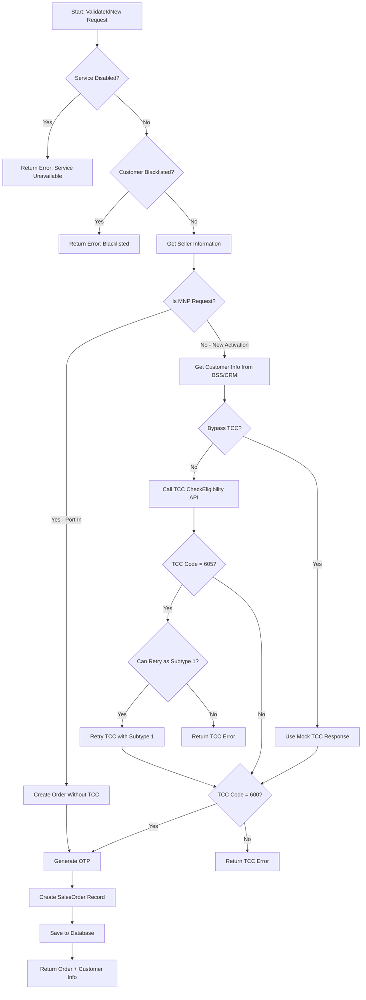
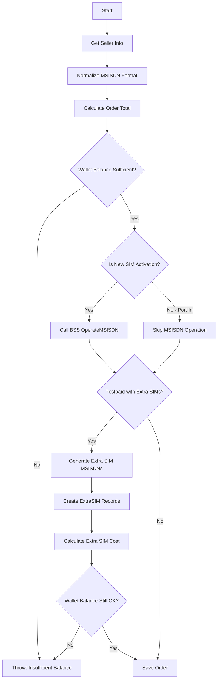
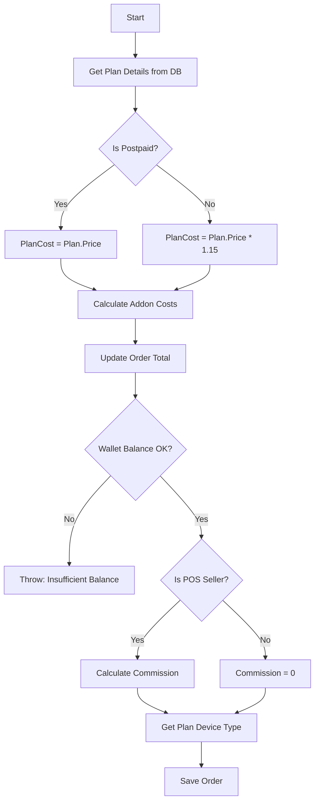
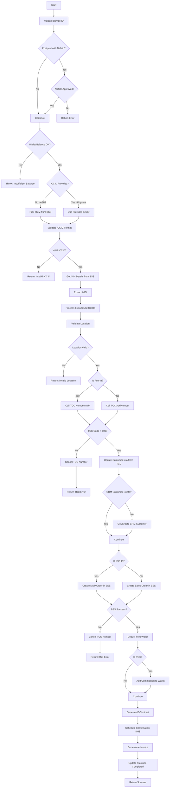
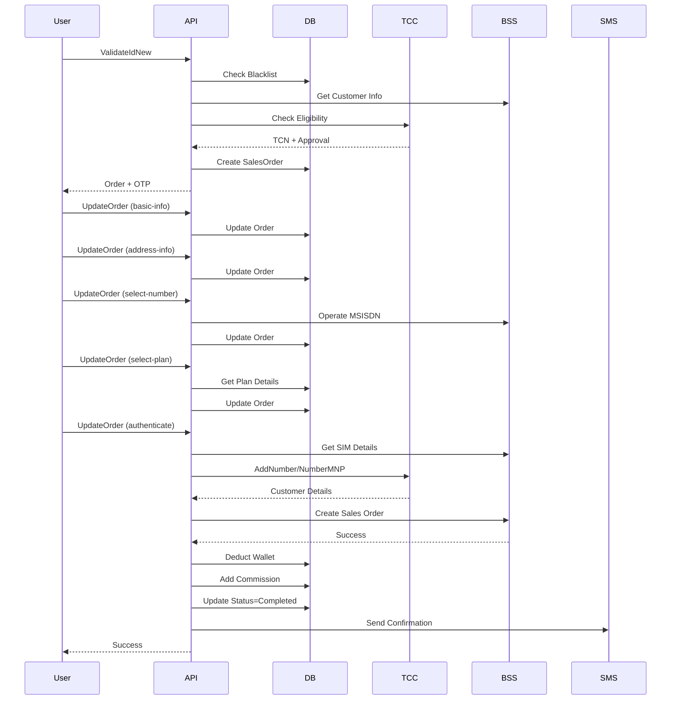

# Prepaid Call Line with Physical SIM - Activation Flow

This document describes the detailed flow for activating a prepaid call line with a physical SIM card in the Red Bull Mobile Sales Portal.

## Overview

The activation process consists of two main phases:
1. **Validation Phase** - Customer ID validation and order creation
2. **Activation Phase** - Multi-step order completion with external system integrations

---

## Phase 1: Validation & Order Creation

### Endpoint: [ValidateIdNew](file:///c:/Users/FarahAhmed/Downloads/RedBullSalesPortalRestSharp/RedBullSalesPortalRestSharp/RedBullSalesPortal/RedBullSalesPortal.Web/Modules/SalesAPI/SalesAPIController.cs#928-1104)

**Purpose**: Validate customer identity, check TCC eligibility, and create a new sales order.

### Flow Steps



### Key Validations

1. **Service Availability Check**
   - Configuration: `AppSettings:DisableActivation`
   - If `"1"`, service is disabled

2. **Blacklist Check**
   - Query: `BlackLists` table by `IdNumber`
   - Reject if found

3. **Seller Authorization**
   - POS sellers (SellerChannel = 1) cannot sell postpaid

4. **TCC Eligibility**
   - **SubType Determination**:
     - `0` = Prepaid
     - `1` = Postpaid
     - `2` = Prepaid with special handling
   - **TCC Response Codes**:
     - `600` = Success
     - `605` = Retry with different SubType
     - Other = Rejection

### Database Operations

**Table**: `SalesOrders`

**Fields Created**:
- `SellerId` - Current user ID
- `EligibilityTCN` - TCC transaction number
- `IdNumber`, `Nationality`, [IdType](file:///c:/Users/FarahAhmed/Downloads/RedBullSalesPortalRestSharp/RedBullSalesPortalRestSharp/RedBullSalesPortal/RedBullSalesPortal.Web/Modules/SalesAPI/SalesAPIController.cs#116-124) - Customer identity
- `SubType` - Service type (prepaid/postpaid)
- `FirstName`, `LastName` - From BSS/CRM
- `CRMCustomerId` - BSS customer ID
- `ContactNumber` - Customer contact
- [Status](file:///c:/Users/FarahAhmed/Downloads/RedBullSalesPortalRestSharp/RedBullSalesPortalRestSharp/RedBullSalesPortal/RedBullSalesPortal.Web/Modules/SalesAPI/SalesAPIController.cs#619-632) = `OrderStatus.New` (0)
- `OrderDate` = Current timestamp
- [OTP](file:///c:/Users/FarahAhmed/Downloads/RedBullSalesPortalRestSharp/RedBullSalesPortalRestSharp/RedBullSalesPortal/RedBullSalesPortal.Web/Modules/SalesAPI/SalesAPIController.cs#3715-3724) - 4-digit random code
- `OTPExpiry` - Current time + 5 minutes
- `PartnerId` - Seller's partner
- `IsMNP` - Activation type (1-5)
- `IsESim` - 0 for physical SIM
- `IsPostpaid` - 0 for prepaid, 1 for postpaid

---

## Phase 2: Order Activation (Multi-Step)

### Endpoint: [UpdateOrder](file:///c:/Users/FarahAhmed/Downloads/RedBullSalesPortalRestSharp/RedBullSalesPortalRestSharp/RedBullSalesPortal/RedBullSalesPortal.Web/Modules/SalesAPI/SalesAPIController.cs#1172-1585)

**Purpose**: Complete the order through multiple steps with customer information, plan selection, and final activation.

### Step 1: Basic Information (`step = "basic-info"`)

**Purpose**: Capture customer personal details


**Updates**:
- [Status](file:///c:/Users/FarahAhmed/Downloads/RedBullSalesPortalRestSharp/RedBullSalesPortalRestSharp/RedBullSalesPortal/RedBullSalesPortal.Web/Modules/SalesAPI/SalesAPIController.cs#619-632) → `OrderStatus.InProgress` (1)
- `FirstName`, `LastName`, [Email](file:///c:/Users/FarahAhmed/Downloads/RedBullSalesPortalRestSharp/RedBullSalesPortalRestSharp/RedBullSalesPortal/RedBullSalesPortal.Web/Modules/SalesAPI/SalesAPIController.cs#86-97)

---

### Step 2: Address Information (`step = "address-info"`)

**Purpose**: Capture customer location

**Updates**:
- `OrderLat`, `OrderLng` - GPS coordinates
- `OrderCity` - City name
- `OrderAddress` - Full address

---

### Step 3: Number Selection (`step = "select-number"`)

**Purpose**: Assign MSISDN and handle extra SIMs



**Key Operations**:

1. **MSISDN Normalization**
   - Remove prefixes: `05`, `+9665`, `5`, `009665`, `9665`
   - Store as: `5XXXXXXXX`

2. **Cost Calculation**
   ```
   OrderTotal = MSISDNCost + PlanCost + AddonsCost
   MSISDNCost = MSISDNCost * (1 + VAT)
   ```

3. **Extra SIM Handling** (Postpaid only)
   - Get data MSISDNs from BSS
   - Create [ExtraSIM](file:///c:/Users/FarahAhmed/Downloads/RedBullSalesPortalRestSharp/RedBullSalesPortalRestSharp/RedBullSalesPortal/RedBullSalesPortal.Web/Modules/SalesAPI/SalesAPIController.cs#2938-2961) records
   - Calculate extra SIM cost
   - First extra SIM is free, others cost `ExtraSIMCost`

4. **Wallet Validation**
   - Check: `OrderTotal <= Seller.WalletBalance`

**Updates**:
- [MSISDN](file:///c:/Users/FarahAhmed/Downloads/RedBullSalesPortalRestSharp/RedBullSalesPortalRestSharp/RedBullSalesPortal/RedBullSalesPortal.Web/Modules/SalesAPI/SalesAPIController.cs#3024-3066), `MSISDNCost`, `OrderTotal`
- `IsMNP`, `MNPOperator`
- Extra SIM records in [ExtraSIMs](file:///c:/Users/FarahAhmed/Downloads/RedBullSalesPortalRestSharp/RedBullSalesPortalRestSharp/RedBullSalesPortal/RedBullSalesPortal.Web/Modules/SalesAPI/SalesAPIController.cs#2938-2961) table

---

### Step 4: Plan Selection (`step = "select-plan"`)

**Purpose**: Select service plan and add-ons



**Cost Calculations**:
- **Prepaid**: All costs include 15% VAT
- **Postpaid**: Costs without VAT (billed later)

**Commission Calculation** (POS only):
- Base: `MSISDNCost * 0.15`
- Plan: `Plan.Price * Plan.Commission`
- Addons: `Addon.Price * Commission Rate`
- Final: Maximum of all calculated values

**Updates**:
- `PlanId`, `PlanName`, [Addons](file:///c:/Users/FarahAhmed/Downloads/RedBullSalesPortalRestSharp/RedBullSalesPortalRestSharp/RedBullSalesPortal/RedBullSalesPortal.Web/Modules/SalesAPI/SalesAPIController.cs#2493-2533)
- `PlanCost`, `AddonsCost`, `OrderTotal`
- [Commission](file:///c:/Users/FarahAhmed/Downloads/RedBullSalesPortalRestSharp/RedBullSalesPortalRestSharp/RedBullSalesPortal/RedBullSalesPortal.Web/Modules/SalesAPI/SalesAPIController.cs#1128-1152), `DeviceType`

---

### Step 5: Authentication & Activation (`step = "authenticate"`)

**Purpose**: Final authentication and activation with external systems

This is the most complex step involving multiple external API calls.



### Detailed Sub-Processes

#### 5.1 ICCID Validation

**Physical SIM**:
- Format: `899661` + 13 or 14 digits
- Regex: `^899661\d{13}$` or `^899661\d{14}$`

**eSIM**:
- Retrieved from BSS via `PickESim()`

#### 5.2 IMSI Extraction

**Physical SIM**:
- Retrieved from BSS `GetSIMDetails()`

**eSIM**:
- Calculated: `42010` + ICCID substring

#### 5.3 Location Validation

**Checks**:
1. Coordinates provided
2. Within seller's allowed region
3. Distance validation from seller's registered location

#### 5.4 TCC Integration

**For New Activation** (`AddNumber`):
- Registers new number with TCC
- Provides customer biometric/authentication data
- Returns customer name from government database

**For Port-In** (`NumberMNP`):
- Validates MNP eligibility
- Registers port-in request
- Returns customer details

**TCC Response Processing**:
- Extract `borderNumber` (government ID)
- Update `IdNumber` with border number
- Update customer name from TCC response
- Store `ActivationTCN`

#### 5.5 BSS/CRM Integration

**Customer Creation/Retrieval**:
- Call `GetCustomerInformation()`
- If not exists, creates new customer
- Returns `CRMCustomerId`

**Order Creation**:

**For New SIM** (`CreateSalesOrder`):
```
Parameters:
- Order details
- Seller info
- Plan details
- Commitment matrix (postpaid)
- Initial balance (prepaid)
```

**For Port-In** (`CreateSalesMNPOrder`):
```
Parameters:
- Order details
- Seller info
- Plan details
- Commitment matrix (postpaid)
- MNP operator info
```

**Initial Balance Calculation** (Prepaid only):
```
InitialBalance = 0
If Plan.InitBalanceActivation == 1:
    InitialBalance += Plan.Price
For each Addon:
    If Addon.InitBalanceActivation == 1:
        InitialBalance += Addon.Price
```

#### 5.6 Financial Transactions

**Wallet Deduction**:
```
WalletBalanceBefore = Seller.WalletBalance
Seller.WalletBalance -= OrderTotal
WalletBalanceAfter = Seller.WalletBalance
```

**Commission Addition** (POS only):
```
Create SellerCommission record
Seller.WalletBalance += Commission
```

#### 5.7 Post-Activation Tasks

**E-Contract Generation**:
- Template: `Templates/html/index.html`
- Includes order details, customer info, terms
- Stored as PDF

**Confirmation SMS** (Delayed 2 minutes):
```
Message: "Thank you for choosing Red Bull Mobile,
We confirm receiving {OrderTotal} SAR for your order 
for your number {MSISDN} and your package {PlanName}
You can review your service contract by clicking here 
http://sales.redbullmobile.sa/api/Sales/downloadEContract?orderId={OrderId}"
```

**e-Invoice Generation** (ZATCA compliance):
- For specific seller channels
- Includes VAT breakdown
- SMS with invoice link

#### 5.8 Error Handling

**TCC Failure**:
- Cancel number via `CancelNumberGeneric()`
- Rollback order
- Return error to user

**BSS Failure**:
- Cancel TCC number
- Rollback order
- Return error to user

**Wallet Insufficient**:
- Reject before any external calls
- No rollback needed

### Final Updates

**Order Status**:
- [Status](file:///c:/Users/FarahAhmed/Downloads/RedBullSalesPortalRestSharp/RedBullSalesPortalRestSharp/RedBullSalesPortal/RedBullSalesPortal.Web/Modules/SalesAPI/SalesAPIController.cs#619-632) → `OrderStatus.Completed` (2)
- `IndividualCheckComplete` = true
- `ActivationTCN` = TCC transaction number
- `EContractFileName` = Generated PDF filename

---

## External System Integrations

### 1. BSS (Business Support System)

**Base URL**: `https://185.23.125.108:17131`

**Key APIs**:
- `GetCustomerInformation()` - Retrieve/create customer
- `GetSIMDetails()` - Validate physical SIM
- `PickESim()` - Allocate eSIM
- `OperateMSISDN()` - Reserve MSISDN
- `GetDataMSISDN()` - Get data-only number
- `CreateSalesOrder()` - Create new activation
- `CreateSalesMNPOrder()` - Create port-in order
- `UpdateCustomerEmail()` - Update customer email

### 2. TCC (Telecom Regulatory Authority)

**Purpose**: Government compliance for SIM registration

**Key APIs**:
- [CheckEligibility()](file:///c:/Users/FarahAhmed/Downloads/RedBullSalesPortalRestSharp/RedBullSalesPortalRestSharp/RedBullSalesPortal/RedBullSalesPortal.Web/Modules/SalesAPI/SalesAPIController.cs#2664-2670) - Pre-activation eligibility
- `AddNumber()` - Register new number
- `NumberMNP()` - Register port-in
- `CancelNumberGeneric()` - Rollback on failure
- `SendBallighny()` - Send SMS via TCC

**Authentication Methods**:
- Fingerprint biometric
- IAM Token (Nafath)
- Absher Token
- OTP

### 3. Semati (IAM Provider)

**Base URL**: `https://185.23.125.108:8085`

**Purpose**: Nafath authentication for identity verification

### 4. SMS Gateway (SMPP)

**Server**: `79.139.94.214:8313`

**Purpose**: Send OTP and confirmation messages

---

## Database Schema

### Key Tables

**SalesOrders**:
- Primary order record
- Tracks all order details and status
- Links to seller, partner, plan

**ExtraSIMs**:
- Additional SIMs for postpaid
- Links to parent order
- Tracks ICCID, MSISDN, status

**SellerCommissions**:
- Commission records for POS
- Tracks wallet changes

**PromissoryNotes**:
- Nafath approval records for postpaid
- Links to order via `OrderId = "SLS{OrderId}"`

**BlackLists**:
- Blocked customer IDs

---

## Activation Types (IsMNP Enum)

| Value | Type | Description |
|-------|------|-------------|
| 1 | PrepaidNewSIM | New prepaid with physical SIM |
| 2 | PrepaidPortIn | Port-in to prepaid |
| 3 | PostpaidNewSIM | New postpaid with physical SIM |
| 4 | PostpaidPortIn | Port-in to postpaid |
| 5 | PrepaidDataSIM | Data-only prepaid |

---

## Order Status Flow

```
New (0) → InProgress (1) → Completed (2)
                         ↓
                    Failed/Cancelled
```

---

## Configuration Settings

### Critical Settings

**AppSettings**:
- `DisableActivation` - Emergency kill switch
- `BypassTCC` - Skip TCC for testing
- `BypassBSS` - Skip BSS for testing
- `SIMReplacementCost` - SIM replacement fee
- `SpecialCommission` - Custom commission rates

**VAT**:
- Rate: 15% (0.15)
- Applied to prepaid only

---

## Security & Compliance

### Authentication
- JWT Bearer token required
- User must be authenticated seller

### Location Validation
- GPS coordinates required
- Validated against seller's region
- Distance checks enforced

### Identity Verification
- TCC integration mandatory
- Government database validation
- Biometric/Nafath authentication

### Financial Controls
- Wallet balance checks
- Transaction logging
- Commission tracking

---

## Error Scenarios

| Scenario | Handling |
|----------|----------|
| Service disabled | Immediate rejection |
| Blacklisted customer | Immediate rejection |
| Insufficient wallet | Reject before external calls |
| TCC failure | Cancel number, rollback |
| BSS failure | Cancel TCC, rollback |
| Invalid ICCID | Reject before activation |
| Invalid location | Reject before TCC |
| Duplicate MSISDN | BSS handles, retry |

---

## Summary Flow Diagram



---

## Notes

- **Prepaid**: Immediate activation with initial balance
- **Physical SIM**: ICCID must be provided and validated
- **VAT**: 15% applied to prepaid costs only
- **Commission**: Only for POS sellers (SellerChannel = 1)
- **Extra SIMs**: Postpaid only, first one free
- **Rollback**: TCC cancellation on any failure after TCC approval
