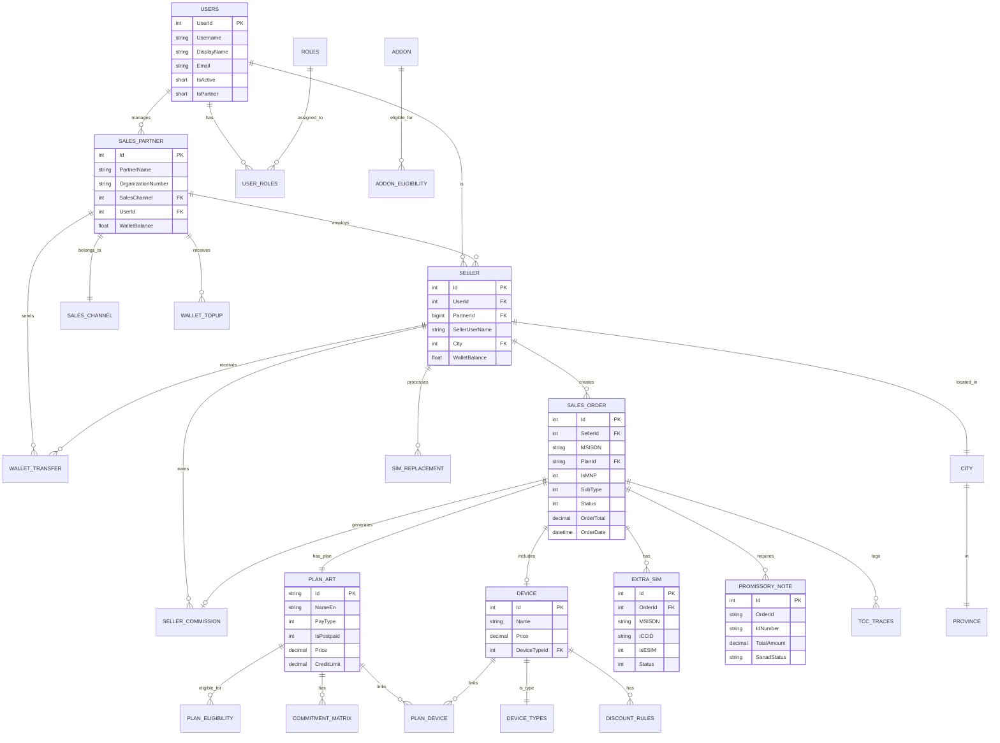
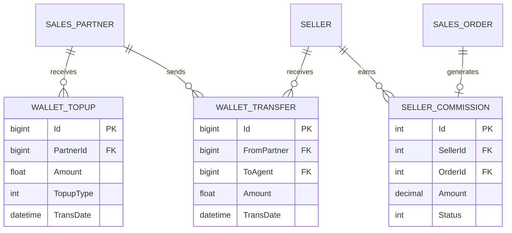

# RedBull Sales Portal - Database Reverse Engineering & ERD Documentation

> **Generated from:** Serenity Row Classes + Entity Framework Core Models
> **Framework:** Serenity Platform + .NET 6
> **Domain:** Telecom Postpaid/Prepaid Sales Portal (Saudi Arabia)
> **Database:** Microsoft SQL Server (`SalesPartnerPortal_Default_v1`)

---

## Table of Contents

1. [How Serenity Maps Code to Database](#1-how-serenity-maps-code-to-database)
2. [Complete Table Inventory](#2-complete-table-inventory)
3. [Detailed Table Documentation](#3-detailed-table-documentation)
   - [Core Transactional Tables](#31-core-transactional-tables)
   - [User & Partner Management](#32-user--partner-management)
   - [SIM & Device Management](#33-sim--device-management)
   - [Wallet & Financial Tables](#34-wallet--financial-tables)
   - [Lookup & Reference Tables](#35-lookup--reference-tables)
   - [TCC Integration Tables](#36-tcc-integration-tables)
   - [Reports & Views](#37-reports--views)
   - [Temporary & Utility Tables](#38-temporary--utility-tables)
4. [Cross-Table Relationship Matrix](#4-cross-table-relationship-matrix)
5. [ERD – Entity Relationship Diagram](#5-erd--entity-relationship-diagram)
6. [Gaps, Risks & Legacy Issues](#6-gaps-risks--legacy-issues)
7. [Database Rebuild Guidance](#7-database-rebuild-guidance)

---

## 1. How Serenity Maps Code to Database

### 1.1 Dual ORM Pattern (Critical)

This codebase uses **TWO different ORM patterns** for the same tables:

| Pattern | Location | Purpose |
|---------|----------|---------|
| **EF Core Models** | `Models/Tables/*.cs` | API operations, business logic in `SalesAPIController` |
| **Serenity Rows** | `Modules/**/Row.cs` | Admin UI, Reports, CRUD operations |

**⚠️ RED FLAG:** Same tables have different class definitions. When rebuilding, use EF Core models as source of truth for column definitions.

### 1.2 Serenity Row → Database Mapping Rules

| Serenity Attribute | Database Effect |
|--------------------|-----------------|
| `[TableName("X")]` | Maps to table `X` |
| `[Column("X")]` | Maps to column `X` (when C# name differs) |
| `[PrimaryKey]` | Primary Key |
| `[Identity]` | Auto-increment identity column |
| `[NotNull]` | NOT NULL constraint |
| `[Size(n)]` | varchar(n) / nvarchar(n) |
| `[Scale(n)]` | Decimal precision |
| `[ForeignKey("Table", "Col")]` | FK reference (logical, not enforced) |
| `[LeftJoin("alias")]` | SQL LEFT JOIN for queries |
| `[Expression("...")]` | **NOT A COLUMN** - computed at query time |

### 1.3 EF Core Model → Database Mapping

| EF Attribute | Database Effect |
|--------------|-----------------|
| `[Table("X")]` | Maps to table `X` |
| `[Key]` | Primary Key |
| `[DatabaseGenerated(Identity)]` | Auto-increment |
| `[NotMapped]` | **NOT A COLUMN** - C# only |
| `[ForeignKey("X")]` | FK constraint (may be enforced) |

---

## 2. Complete Table Inventory

### 2.1 All Tables (78 Total)

| # | Table Name | EF Model | Serenity Row | Category |
|---|------------|----------|--------------|----------|
| 1 | `SalesOrder` | ✅ | ❌ | Core Transaction |
| 2 | `Seller` | ✅ | ✅ | User Management |
| 3 | `SalesPartner` | ✅ | ✅ | User Management |
| 4 | `Users` | ✅ | ✅ | User Management |
| 5 | `PlanArt` | ✅ | ✅ | Lookup |
| 6 | `Addon` | ✅ | ✅ | Lookup |
| 7 | `Device` | ✅ | ✅ | Lookup |
| 8 | `DeviceTypes` | ✅ | ❌ | Lookup |
| 9 | `PlanDevice` | ✅ | ❌ | Junction |
| 10 | `ExtraSIM` | ✅ | ❌ | SIM Management |
| 11 | `ExtraSIMOrder` | ✅ | ❌ | SIM Management |
| 12 | `SimReplacement` | ✅ | ✅ | SIM Management |
| 13 | `SIMTransfer` | ✅ | ✅ | SIM Management |
| 14 | `BulkSIMTransfer` | ✅ | ❌ | SIM Management |
| 15 | `ESIMActivationCode` | ✅ | ❌ | SIM Management |
| 16 | `PromissoryNote` | ✅ | ✅ | Financial |
| 17 | `IncompletePromissoryNote` | ✅ | ❌ | Financial |
| 18 | `CommitmentMatrix` | ✅ | ✅ | Financial |
| 19 | `SellerCommission` | ✅ | ✅ | Financial |
| 20 | `WalletTopup` | ✅ | ✅ | Wallet |
| 21 | `WalletTransfer` | ✅ | ✅ | Wallet |
| 22 | `WalletReverse` | ✅ | ❌ | Wallet |
| 23 | `RechargeHistory` | ✅ | ✅ | Wallet |
| 24 | `AddonHistory` | ✅ | ❌ | Wallet |
| 25 | `PaymentReference` | ✅ | ❌ | Wallet |
| 26 | `TransferOwnership` | ✅ | ✅ | Transaction |
| 27 | `LineTermination` | ✅ | ✅ | Transaction |
| 28 | `TerminationRequest` | ✅ | ❌ | Transaction |
| 29 | `ChangeSubscription` | ✅ | ✅ | Transaction |
| 30 | `ChangeSubscriptionEligibility` | ✅ | ❌ | Lookup |
| 31 | `ReAuthenticateNumbers` | ✅ | ❌ | Transaction |
| 32 | `DeviceSalesOrder` | ✅ | ✅ | Transaction |
| 33 | `DiscountRules` | ✅ | ❌ | Lookup |
| 34 | `City` | ✅ | ✅ | Lookup |
| 35 | `Province` | ✅ | ✅ | Lookup |
| 36 | `SalesChannel` | ✅ | ✅ | Lookup |
| 37 | `MNPOperator` | ✅ | ❌ | Lookup |
| 38 | `TCCNationality` | ✅ | ❌ | Lookup |
| 39 | `TCCIdType` | ✅ | ❌ | Lookup |
| 40 | `RechargeFaceValue` | ✅ | ✅ | Lookup |
| 41 | `PlanEligibility` | ✅ | ✅ | Junction |
| 42 | `AddonEligibility` | ✅ | ✅ | Junction |
| 43 | `OfferLimit` | ✅ | ❌ | Config |
| 44 | `Roles` | ✅ | ✅ | Auth |
| 45 | `UserRoles` | ✅ | ✅ | Auth (Junction) |
| 46 | `UserSectionEligibility` | ✅ | ❌ | Auth |
| 47 | `TCCTraces` | ✅ | ✅ | Audit/Log |
| 48 | `TCCTracesArchive` | ✅ | ❌ | Audit/Log |
| 49 | `TccTraces` | ✅ | ✅ | Audit/Log |
| 50 | `eInvoice` | ✅ | ❌ | Financial |
| 51 | `Tabby` | ✅ | ❌ | Payment |
| 52 | `NafithToken` | ✅ | ❌ | Token |
| 53 | `SematiToken` | ✅ | ❌ | Token |
| 54 | `CollectionMessage` | ✅ | ❌ | Notification |
| 55 | `BlackListIDs` | ✅ | ❌ | Security |
| 56 | `CustomerInfo` | ✅ | ❌ | Cache |
| 57 | `CompletedOrders` | ✅ | ❌ | View/Cache |
| 58 | `CompletedOrderWithCommission` | ✅ | ❌ | View |
| 59 | `ShiftTransactions` | ✅ | ❌ | Report View |
| 60 | `ShiftTransactionDetails` | ✅ | ❌ | Report View |
| 61 | `SellerShift` | ✅ | ❌ | Operational |
| 62 | `ExtraSIMView` | ✅ | ❌ | View |
| 63 | `ExtraSIMViewPreprod` | ✅ | ❌ | View |
| 64 | `ExtraSIMOrderView` | ✅ | ❌ | View |
| 65 | `SalesActivationReport` | ❌ | ✅ | Report View |
| 66 | `ExtraSIMReport` | ❌ | ✅ | Report View |
| 67 | `TMP_PickedList` | ✅ | ❌ | Temp |
| 68 | `TMP_IdNumbers` | ✅ | ❌ | Temp |
| 69 | `TMP_BSS_SIM` | ✅ | ❌ | Temp |
| 70 | `TMP_Manafth_Range` | ✅ | ❌ | Temp |
| 71 | `ManafithRanges` | ✅ | ❌ | Config |
| 72 | `ManafthRangeLog` | ✅ | ❌ | Log |
| 73 | `PoolCleanup` | ✅ | ❌ | Utility |
| 74 | `ToBeUnpicked` | ✅ | ❌ | Utility |
| 75 | `TygoUnpick` | ✅ | ❌ | Utility |
| 76 | `ToBeCancelledFromTCC` | ✅ | ❌ | Utility |
| 77 | `WrongCreditLimits` | ✅ | ❌ | Utility |
| 78 | `BSSEmails` | ✅ | ❌ | Utility |
| 79 | `NoEmailNumber` | ✅ | ❌ | Utility |
| 80 | `ApiTest` | ✅ | ❌ | Debug |
| 81 | `MobileAlreadyExistsCancel` | ✅ | ❌ | Utility |

---

## 3. Detailed Table Documentation

### 3.1 Core Transactional Tables

---

#### 📄 Table: `SalesOrder`

**Source:** `Models/Tables/SalesOrder.cs`
**Purpose:** Master table for all telecom sales activations (Prepaid/Postpaid, New SIM/Port-In/Data SIM)

##### 🧱 Columns

| Column | C# Type | DB Type | Nullable | PK | FK | Description |
|--------|---------|---------|----------|----|----|-------------|
| `Id` | `int` | `INT IDENTITY` | NO | ✅ | - | Primary Key |
| `SellerId` | `int` | `INT` | NO | - | → `Seller.Id` | Seller who made the sale |
| `MSISDN` | `string` | `NVARCHAR` | YES | - | - | Mobile number (05XXXXXXXX) |
| `PlanId` | `string` | `NVARCHAR` | YES | - | → `PlanArt.Id` | Selected plan |
| `PlanName` | `string` | `NVARCHAR` | YES | - | - | Denormalized plan name |
| `ICCID` | `string` | `NVARCHAR` | YES | - | - | SIM card ICCID |
| `IMSI` | `string` | `NVARCHAR` | YES | - | - | SIM IMSI number |
| `IsMNP` | `ActivationType` | `INT` | NO | - | - | 0=PrepaidNew, 1=PrepaidPortIn, 2=PrepaidData, 3=PostpaidNew, 4=PostpaidPortIn, 5=PostpaidData, 6=Device |
| `MNPOperator` | `string` | `NVARCHAR` | YES | - | - | Source operator for Port-In |
| `SubType` | `int` | `INT` | NO | - | - | 0=Prepaid, 1=Postpaid, 2=Hybrid |
| `IsPostpaid` | `int?` | `INT` | YES | - | - | 0=Prepaid, 1=Postpaid |
| `IsESim` | `int?` | `INT` | YES | - | - | 0=Physical SIM, 1=eSIM |
| `Status` | `OrderStatus` | `INT` | NO | - | - | 0=New, 1=InProgress, 2=Completed, 4=Canceled, 5=Failed |
| `OrderTotal` | `decimal` | `DECIMAL(18,2)` | NO | - | - | Total order amount |
| `MSISDNCost` | `decimal?` | `DECIMAL(18,2)` | YES | - | - | MSISDN/Number cost |
| `PlanCost` | `decimal?` | `DECIMAL(18,2)` | YES | - | - | Plan cost |
| `AddonsCost` | `decimal?` | `DECIMAL(18,2)` | YES | - | - | Total addons cost |
| `ExtraSIMCost` | `decimal?` | `DECIMAL(18,2)` | YES | - | - | Extra SIM cost |
| `Commission` | `decimal` | `DECIMAL(18,2)` | NO | - | - | Seller commission |
| `WalletBalanceBefore` | `decimal` | `DECIMAL(18,2)` | NO | - | - | Wallet balance before deduction |
| `WalletBalanceAfter` | `decimal` | `DECIMAL(18,2)` | NO | - | - | Wallet balance after deduction |
| `IdNumber` | `string` | `NVARCHAR` | YES | - | - | Customer National ID |
| `IdType` | `IdType` | `INT` | NO | - | - | 1=Citizen, 2=Resident, 3=Visitor, etc. |
| `Nationality` | `int` | `INT` | NO | - | - | Nationality code |
| `FirstName` | `string` | `NVARCHAR` | YES | - | - | Customer first name |
| `LastName` | `string` | `NVARCHAR` | YES | - | - | Customer last name |
| `ContactNumber` | `string` | `NVARCHAR` | YES | - | - | Customer contact number |
| `Email` | `string` | `NVARCHAR` | YES | - | - | Customer email |
| `CRMCustomerId` | `string` | `NVARCHAR` | YES | - | - | BSS/CRM Customer ID |
| `OrderLat` | `string` | `NVARCHAR` | YES | - | - | GPS Latitude |
| `OrderLng` | `string` | `NVARCHAR` | YES | - | - | GPS Longitude |
| `OrderCity` | `string` | `NVARCHAR` | YES | - | - | City name |
| `OrderAddress` | `string` | `NVARCHAR` | YES | - | - | Full address |
| `OrderDate` | `DateTime` | `DATETIME` | NO | - | - | Order timestamp |
| `OTP` | `string` | `NVARCHAR` | YES | - | - | One-time password |
| `OTPExpiry` | `DateTime` | `DATETIME` | NO | - | - | OTP expiration |
| `Addons` | `string` | `NVARCHAR(MAX)` | YES | - | - | JSON array of addon IDs |
| `UseIAMToken` | `int` | `INT` | NO | - | - | 0=Biometric, 1=IAM Token |
| `IAMToken` | `string` | `NVARCHAR` | YES | - | - | IAM authentication token |
| `IamOTP` | `string` | `NVARCHAR` | YES | - | - | IAM OTP |
| `FingerIndex` | `FingerIndex?` | `INT` | YES | - | - | 1-10 finger index |
| `FingerImage` | `string` | `NVARCHAR(MAX)` | YES | - | - | Base64 fingerprint image |
| `TokenType` | `TokenType` | `INT` | NO | - | - | 0=OTP, 1=Token |
| `EligibilityClientTCN` | `string` | `NVARCHAR` | YES | - | - | TCC eligibility client TCN |
| `EligibilityTCN` | `string` | `NVARCHAR` | YES | - | - | TCC eligibility TCN |
| `ActivationClientTCN` | `string` | `NVARCHAR` | YES | - | - | TCC activation client TCN |
| `ActivationTCN` | `string` | `NVARCHAR` | YES | - | - | TCC activation TCN |
| `EContractFileName` | `string` | `NVARCHAR` | YES | - | - | E-contract file path |
| `PartnerId` | `int?` | `INT` | YES | - | → `SalesPartner.Id` | Partner ID |
| `DeviceType` | `int?` | `INT` | YES | - | → `Device.Id` | Device ID (if device sale) |
| `DeviceSerial` | `string` | `NVARCHAR` | YES | - | - | Device serial number |
| `IndividualCheckComplete` | `bool` | `BIT` | NO | - | - | Individual check completed |
| `OnBehalfOf` | `string` | `NVARCHAR` | YES | - | - | Acting on behalf of |
| `Remarks` | `string` | `NVARCHAR(MAX)` | YES | - | - | Remarks/notes |

##### 🔗 Relationships

| Related Table | Relationship | FK Column |
|---------------|--------------|-----------|
| `Seller` | Many-to-One | `SellerId` |
| `SalesPartner` | Many-to-One | `PartnerId` |
| `PlanArt` | Many-to-One | `PlanId` |
| `Device` | Many-to-One | `DeviceType` |
| `ExtraSIM` | One-to-Many | `ExtraSIM.OrderId` |
| `SellerCommission` | One-to-One | `SellerCommission.OrderId` |
| `PromissoryNote` | One-to-Many | via `OrderId` column |

##### 🔄 Lifecycle

1. **Created:** When customer initiates order (`Status = New`)
2. **Updated:** Multiple steps (basic-info, address, select-number, select-plan)
3. **Completed:** After TCC registration + BSS order creation (`Status = Completed`)
4. **Canceled:** If user cancels or error occurs (`Status = Canceled/Failed`)

##### ⚠️ Ambiguities

- `IsPostpaid` vs `SubType` - redundant fields, both indicate Prepaid/Postpaid
- `Addons` stored as JSON string, not normalized
- No FK constraints enforced in database

---

#### 📄 Table: `ExtraSIM`

**Source:** `Models/Tables/SimReplacement.cs`
**Purpose:** Additional SIM lines linked to a primary postpaid order

##### 🧱 Columns

| Column | C# Type | DB Type | Nullable | PK | FK | Description |
|--------|---------|---------|----------|----|----|-------------|
| `Id` | `int` | `INT IDENTITY` | NO | ✅ | - | Primary Key |
| `OrderId` | `int` | `INT` | NO | - | → `SalesOrder.Id` | Parent order |
| `MSISDN` | `string` | `NVARCHAR` | YES | - | - | Extra SIM number |
| `ICCID` | `string` | `NVARCHAR` | YES | - | - | SIM ICCID |
| `IsESIM` | `int` | `INT` | NO | - | - | 0=Physical, 1=eSIM |
| `Status` | `int` | `INT` | NO | - | - | Order status |
| `AddedDate` | `DateTime` | `DATETIME` | NO | - | - | Creation timestamp |
| `OrderType` | `int` | `INT` | NO | - | - | Order type |
| `OrderLat` | `string` | `NVARCHAR` | YES | - | - | GPS Latitude |
| `OrderLng` | `string` | `NVARCHAR` | YES | - | - | GPS Longitude |
| `TCCRequest` | `string` | `NVARCHAR(MAX)` | YES | - | - | TCC API request |
| `TCCResponse` | `string` | `NVARCHAR(MAX)` | YES | - | - | TCC API response |
| `BSSRequest` | `string` | `NVARCHAR(MAX)` | YES | - | - | BSS API request |
| `BSSResponse` | `string` | `NVARCHAR(MAX)` | YES | - | - | BSS API response |

##### ⚠️ Ambiguities

- `OrderType` meaning not documented in code
- Only for Postpaid (not enforced by constraint)

---

#### 📄 Table: `PromissoryNote`

**Source:** `Models/Tables/PromissoryNote.cs`
**Purpose:** Nafith promissory notes for postpaid customers (credit commitments)

##### 🧱 Columns

| Column | C# Type | DB Type | Nullable | PK | FK | Description |
|--------|---------|---------|----------|----|----|-------------|
| `Id` | `int` | `INT IDENTITY` | NO | ✅ | - | Primary Key |
| `IdNumber` | `string` | `NVARCHAR` | YES | - | - | Customer National ID |
| `MSISDN` | `string` | `NVARCHAR` | YES | - | - | Mobile number |
| `OrderType` | `int` | `INT` | NO | - | - | Order type |
| `OrderId` | `string` | `NVARCHAR` | YES | - | - | Format: "SLS{OrderId}" |
| `TotalAmount` | `decimal` | `DECIMAL(18,2)` | NO | - | - | Note amount |
| `City` | `string` | `NVARCHAR` | YES | - | - | City |
| `ContactNumber` | `string` | `NVARCHAR` | YES | - | - | Contact number |
| `DueDate` | `DateTime` | `DATETIME` | NO | - | - | Payment due date |
| `ReferenceId` | `string` | `NVARCHAR` | YES | - | - | Nafith reference |
| `SanadId` | `string` | `NVARCHAR` | YES | - | - | Nafith Sanad ID |
| `IssueDate` | `DateTime` | `DATETIME` | NO | - | - | Issue date |
| `ApprovalDate` | `DateTime` | `DATETIME` | NO | - | - | Approval date |
| `SanadStatus` | `string` | `NVARCHAR` | YES | - | - | "approved", "pending", etc. |
| `Duration` | `int` | `INT` | NO | - | - | Duration in months |
| `NafithRequest` | `string` | `NVARCHAR(MAX)` | YES | - | - | Nafith API request |
| `NafithResponse` | `string` | `NVARCHAR(MAX)` | YES | - | - | Nafith API response |

---

### 3.2 User & Partner Management

---

#### 📄 Table: `Users`

**Source:** `Administration/User/UserRow.cs`
**Purpose:** System users (admin, partners, sellers)

##### 🧱 Columns

| Column | C# Type | DB Type | Nullable | PK | FK | Description |
|--------|---------|---------|----------|----|----|-------------|
| `UserId` | `int` | `INT IDENTITY` | NO | ✅ | - | Primary Key |
| `Username` | `string` | `NVARCHAR(100)` | NO | - | - | Unique username |
| `PasswordHash` | `string` | `NVARCHAR(86)` | NO | - | - | Hashed password |
| `PasswordSalt` | `string` | `NVARCHAR(10)` | NO | - | - | Password salt |
| `DisplayName` | `string` | `NVARCHAR(100)` | NO | - | - | Display name |
| `Email` | `string` | `NVARCHAR(100)` | YES | - | - | Email address |
| `MobilePhoneNumber` | `string` | `NVARCHAR(20)` | YES | - | - | Mobile number |
| `MobilePhoneVerified` | `bool` | `BIT` | NO | - | - | Phone verified |
| `TwoFactorAuth` | `int?` | `INT` | YES | - | - | 2FA type |
| `UserImage` | `string` | `NVARCHAR(100)` | YES | - | - | Profile image path |
| `Source` | `string` | `NVARCHAR(4)` | NO | - | - | "site" |
| `IsActive` | `short` | `SMALLINT` | NO | - | - | 0=Inactive, 1=Active |
| `IsPartner` | `short` | `SMALLINT` | YES | - | - | Is partner user |
| `OTP` | `string` | `NVARCHAR` | YES | - | - | OTP code |
| `OTPExpiry` | `DateTime?` | `DATETIME` | YES | - | - | OTP expiry |
| `LastDirectoryUpdate` | `DateTime?` | `DATETIME` | YES | - | - | Last sync |
| `InsertDate` | `DateTime` | `DATETIME` | YES | - | - | Created date |
| `InsertUserId` | `int?` | `INT` | YES | - | - | Created by |
| `UpdateDate` | `DateTime?` | `DATETIME` | YES | - | - | Updated date |
| `UpdateUserId` | `int?` | `INT` | YES | - | - | Updated by |

##### 🔗 Relationships

| Related Table | Relationship | FK Column |
|---------------|--------------|-----------|
| `UserRoles` | One-to-Many | `UserRoles.UserId` |
| `SalesPartner` | One-to-One | `SalesPartner.UserId` |
| `Seller` | One-to-One | `Seller.UserId` |

---

#### 📄 Table: `SalesPartner`

**Source:** `Sales/SalesPartner/SalesPartnerRow.cs`
**Purpose:** Sales partner organizations (retailers, dealers)

##### 🧱 Columns

| Column | C# Type | DB Type | Nullable | PK | FK | Description |
|--------|---------|---------|----------|----|----|-------------|
| `Id` | `int` | `INT IDENTITY` | NO | ✅ | - | Primary Key |
| `PartnerName` | `string` | `NVARCHAR(100)` | YES | - | - | Partner name |
| `OrganizationNumber` | `string` | `NVARCHAR(100)` | YES | - | - | CR number |
| `BranchCode` | `string` | `NVARCHAR(100)` | YES | - | - | Branch code |
| `BranchId` | `string` | `NVARCHAR(100)` | YES | - | - | Branch ID |
| `RegistryExpiry` | `DateTime` | `DATETIME` | YES | - | - | CR expiry date |
| `OwnerId` | `string` | `NVARCHAR(50)` | YES | - | - | Owner ID number |
| `NumberOfEmployees` | `int` | `INT` | YES | - | - | Employee count |
| `NumberOfBranches` | `int` | `INT` | YES | - | - | Branch count |
| `OwnerPhone` | `string` | `NVARCHAR(50)` | YES | - | - | Owner phone |
| `OwnerEmail` | `string` | `NVARCHAR(100)` | YES | - | - | Owner email |
| `City` | `int` | `INT` | YES | - | → `City.Id` | City |
| `SalesChannel` | `int` | `INT` | YES | - | → `SalesChannel.Id` | Sales channel |
| `UserId` | `int` | `INT` | YES | - | → `Users.UserId` | Linked user |
| `WalletBalance` | `double` | `FLOAT` | NO | - | - | Current wallet balance |

---

#### 📄 Table: `Seller`

**Source:** `Sales/Seller/SellerRow.cs`
**Purpose:** Individual sellers/agents under partners

##### 🧱 Columns

| Column | C# Type | DB Type | Nullable | PK | FK | Description |
|--------|---------|---------|----------|----|----|-------------|
| `Id` | `int` | `INT` | NO | ✅ | - | Primary Key |
| `UserId` | `int` | `INT` | NO | - | → `Users.UserId` | Linked user |
| `PartnerId` | `long` | `BIGINT` | YES | - | → `SalesPartner.Id` | Parent partner |
| `OrganizationNumber` | `string` | `NVARCHAR(100)` | YES | - | - | Organization number |
| `SellerUserName` | `string` | `NVARCHAR` | YES | - | - | Username (display) |
| `FullNameAr` | `string` | `NVARCHAR(100)` | YES | - | - | Arabic name |
| `FullNameEn` | `string` | `NVARCHAR(100)` | YES | - | - | English name |
| `City` | `int` | `INT` | YES | - | → `City.Id` | City |
| `District` | `string` | `NVARCHAR(100)` | YES | - | - | District |
| `Address` | `string` | `NVARCHAR(250)` | YES | - | - | Address |
| `ManagerId` | `string` | `NVARCHAR` | YES | - | - | Manager ID |
| `IdNumber` | `string` | `NVARCHAR(50)` | YES | - | - | National ID |
| `PhoneNumber` | `string` | `NVARCHAR(50)` | YES | - | - | Phone |
| `SellerChannel` | `int` | `INT` | YES | - | - | Seller channel type |
| `POSUserNumber` | `string` | `NVARCHAR(50)` | YES | - | - | POS user number |
| `POSNameEn` | `string` | `NVARCHAR(100)` | YES | - | - | POS English name |
| `POSNameAr` | `string` | `NVARCHAR(100)` | YES | - | - | POS Arabic name |
| `GPSLat` | `string` | `NVARCHAR(50)` | YES | - | - | GPS Latitude |
| `GPSLng` | `string` | `NVARCHAR(50)` | YES | - | - | GPS Longitude |
| `TCCToken` | `string` | `NVARCHAR(250)` | YES | - | - | TCC auth token |
| `TCCTokenExpiry` | `DateTime` | `DATETIME` | YES | - | - | Token expiry |
| `DeviceID` | `string` | `NVARCHAR(100)` | YES | - | - | Mobile device ID |
| `WalletBalance` | `double` | `FLOAT` | NO | - | - | Current balance |
| `ForceChangePassword` | `int` | `INT` | YES | - | - | Force password change |
| `OTP` | `string` | `NVARCHAR` | YES | - | - | OTP code |
| `OTPExpiry` | `DateTime` | `DATETIME` | YES | - | - | OTP expiry |
| `StaffId` | `int?` | `INT` | YES | - | - | Staff ID |
| `FcmToken` | `string` | `NVARCHAR` | YES | - | - | Firebase token |

---

### 3.3 SIM & Device Management

---

#### 📄 Table: `SimReplacement`

**Source:** `Models/Tables/SimReplacement.cs`
**Purpose:** SIM replacement transactions (swap physical/eSIM)

##### 🧱 Columns

| Column | C# Type | DB Type | Nullable | PK | FK | Description |
|--------|---------|---------|----------|----|----|-------------|
| `Id` | `int` | `INT IDENTITY` | NO | ✅ | - | Primary Key |
| `MSISDN` | `string` | `NVARCHAR` | YES | - | - | Mobile number |
| `OldICCID` | `string` | `NVARCHAR` | YES | - | - | Old SIM ICCID |
| `NewICCID` | `string` | `NVARCHAR` | YES | - | - | New SIM ICCID |
| `IdNumber` | `string` | `NVARCHAR` | YES | - | - | Customer ID |
| `IdType` | `int` | `INT` | NO | - | - | ID type |
| `Nationality` | `int` | `INT` | NO | - | - | Nationality |
| `Status` | `int` | `INT` | NO | - | - | Status |
| `TransDate` | `DateTime` | `DATETIME` | NO | - | - | Transaction date |
| `SellerId` | `int` | `INT` | NO | - | → `Seller.Id` | Seller |
| `ToESIM` | `int` | `INT` | NO | - | - | Converting to eSIM |
| `SubType` | `int?` | `INT` | YES | - | - | Subscription type |
| `Cost` | `decimal` | `DECIMAL` | NO | - | - | Replacement cost |
| `WalletBalanceBefore` | `decimal` | `DECIMAL` | NO | - | - | Balance before |
| `WalletBalanceAfter` | `decimal` | `DECIMAL` | NO | - | - | Balance after |
| `UseIAMToken` | `int` | `INT` | NO | - | - | Use IAM token |
| `IAMToken` | `string` | `NVARCHAR` | YES | - | - | IAM token |
| `FingerIndex` | `int?` | `INT` | YES | - | - | Finger index |
| `FingerImage` | `string` | `NVARCHAR(MAX)` | YES | - | - | Fingerprint |
| `Email` | `string` | `NVARCHAR` | YES | - | - | Email |
| `OrderLat` | `string` | `NVARCHAR` | YES | - | - | GPS Lat |
| `OrderLng` | `string` | `NVARCHAR` | YES | - | - | GPS Lng |

---

#### 📄 Table: `Device`

**Source:** `Models/Tables/SalesOrder.cs`
**Purpose:** Device catalog for sales

##### 🧱 Columns

| Column | C# Type | DB Type | Nullable | PK | FK | Description |
|--------|---------|---------|----------|----|----|-------------|
| `Id` | `int` | `INT` | NO | ✅ | - | Primary Key |
| `Model` | `string` | `NVARCHAR` | YES | - | - | Device model |
| `Name` | `string` | `NVARCHAR` | YES | - | - | Device name |
| `Image` | `string` | `NVARCHAR` | YES | - | - | Image URL |
| `Price` | `decimal` | `DECIMAL` | NO | - | - | Price |
| `Category` | `string` | `NVARCHAR` | YES | - | - | Category |
| `CommitmentPeriod` | `int` | `INT` | NO | - | - | Commitment months |
| `AgreementId` | `string` | `NVARCHAR` | YES | - | - | BSS Agreement ID |
| `OfferId` | `string` | `NVARCHAR` | YES | - | - | BSS Offer ID |
| `ProductId` | `string` | `NVARCHAR` | YES | - | - | BSS Product ID |
| `Standalone` | `int` | `INT` | NO | - | - | Standalone device |
| `Installments` | `int` | `INT` | NO | - | - | Allow installments |
| `IsEnabled` | `int` | `INT` | NO | - | - | Is active |
| `SerialNumber` | `string` | `NVARCHAR` | YES | - | - | Serial number |
| `IsMerchandise` | `bool` | `BIT` | NO | - | - | Is merchandise |
| `DeviceTypeId` | `int` | `INT` | NO | - | → `DeviceTypes.Id` | Device type |

---

### 3.4 Wallet & Financial Tables

---

#### 📄 Table: `WalletTransfer`

**Source:** `Wallet/WalletTransfer/WalletTransferRow.cs`
**Purpose:** Wallet balance transfers from Partner to Seller

##### 🧱 Columns

| Column | C# Type | DB Type | Nullable | PK | FK | Description |
|--------|---------|---------|----------|----|----|-------------|
| `Id` | `long` | `BIGINT IDENTITY` | NO | ✅ | - | Primary Key |
| `FromPartner` | `long` | `BIGINT` | NO | - | → `SalesPartner.Id` | Source partner |
| `ToAgent` | `long` | `BIGINT` | NO | - | → `Seller.Id` | Target seller |
| `Amount` | `double` | `FLOAT` | NO | - | - | Transfer amount |
| `PartnerBalanceBefore` | `double` | `FLOAT` | NO | - | - | Partner balance before |
| `PartnerBalanceAfter` | `double` | `FLOAT` | NO | - | - | Partner balance after |
| `SellerBalanceBefore` | `double` | `FLOAT` | NO | - | - | Seller balance before |
| `SellerBalanceAfter` | `double` | `FLOAT` | NO | - | - | Seller balance after |
| `TransDate` | `DateTime` | `DATETIME` | NO | - | - | Transaction date |
| `TransferBy` | `string` | `NVARCHAR` | YES | - | - | User who transferred |
| `TransferType` | `int?` | `INT` | YES | - | - | Transfer type |
| `ReferenceNo` | `string` | `NVARCHAR` | YES | - | - | Reference number |

---

#### 📄 Table: `WalletTopup`

**Source:** `Models/Tables/Wallet.cs`
**Purpose:** Partner wallet top-ups

##### 🧱 Columns

| Column | C# Type | DB Type | Nullable | PK | FK | Description |
|--------|---------|---------|----------|----|----|-------------|
| `Id` | `long` | `BIGINT IDENTITY` | NO | ✅ | - | Primary Key |
| `PartnerId` | `long` | `BIGINT` | NO | - | → `SalesPartner.Id` | Partner |
| `Amount` | `double` | `FLOAT` | NO | - | - | Topup amount |
| `TopupType` | `TopupType` | `INT` | NO | - | - | 0=Credit, 1=Commission, 2=Deduct |
| `TransDate` | `DateTime` | `DATETIME` | NO | - | - | Transaction date |
| `TopupBy` | `string` | `NVARCHAR` | YES | - | - | Topped up by |
| `BalanceBefore` | `double` | `FLOAT` | NO | - | - | Balance before |
| `BalanceAfter` | `double` | `FLOAT` | NO | - | - | Balance after |
| `ERPReferenceNo` | `string` | `NVARCHAR` | YES | - | - | ERP reference |

---

#### 📄 Table: `SellerCommission`

**Source:** `Wallet/SellerCommission/SellerCommissionRow.cs`
**Purpose:** Commission paid to sellers on completed orders

##### 🧱 Columns

| Column | C# Type | DB Type | Nullable | PK | FK | Description |
|--------|---------|---------|----------|----|----|-------------|
| `Id` | `int` | `INT IDENTITY` | NO | ✅ | - | Primary Key |
| `SellerId` | `int` | `INT` | NO | - | → `Seller.Id` | Seller |
| `OrderId` | `int` | `INT` | NO | - | → `SalesOrder.Id` | Order |
| `Amount` | `decimal` | `DECIMAL(18,2)` | NO | - | - | Commission amount |
| `WalletBalanceBefore` | `decimal` | `DECIMAL(18,2)` | NO | - | - | Balance before |
| `WalletBalanceAfter` | `decimal` | `DECIMAL(18,2)` | NO | - | - | Balance after |
| `Remarks` | `string` | `NVARCHAR(MAX)` | YES | - | - | Remarks |
| `Status` | `int` | `INT` | NO | - | - | Status |

---

### 3.5 Lookup & Reference Tables

---

#### 📄 Table: `PlanArt`

**Source:** `Models/Tables/SalesOrder.cs`
**Purpose:** Mobile plans/packages catalog

##### 🧱 Columns

| Column | C# Type | DB Type | Nullable | PK | FK | Description |
|--------|---------|---------|----------|----|----|-------------|
| `Id` | `string` | `NVARCHAR` | NO | ✅ | - | BSS Plan ID |
| `NameAr` | `string` | `NVARCHAR` | YES | - | - | Arabic name |
| `NameEn` | `string` | `NVARCHAR` | YES | - | - | English name |
| `ArtURL` | `string` | `NVARCHAR(MAX)` | YES | - | - | English art URL |
| `ArArtURL` | `string` | `NVARCHAR(MAX)` | YES | - | - | Arabic art URL |
| `IsActive` | `int` | `INT` | NO | - | - | Is active |
| `PayType` | `int` | `INT` | NO | - | - | 0=Prepaid, 1=Hybrid |
| `IsPostpaid` | `int` | `INT` | NO | - | - | Is postpaid plan |
| `Price` | `decimal` | `DECIMAL` | NO | - | - | Plan price |
| `Benefits` | `string` | `NVARCHAR(MAX)` | YES | - | - | English benefits |
| `BenefitsAr` | `string` | `NVARCHAR(MAX)` | YES | - | - | Arabic benefits |
| `Validity` | `int` | `INT` | NO | - | - | Validity days |
| `Commission` | `decimal` | `DECIMAL` | NO | - | - | Commission rate |
| `AllowedChannels` | `string` | `NVARCHAR(50)` | YES | - | - | Allowed channels |
| `AllowedOrderTypes` | `string` | `NVARCHAR` | YES | - | - | Allowed order types |
| `AllowedIDTypes` | `string` | `NVARCHAR(50)` | YES | - | - | Allowed ID types |
| `AllowedUsers` | `string` | `NVARCHAR` | YES | - | - | Allowed users |
| `ParentPlan` | `string` | `NVARCHAR(MAX)` | YES | - | - | Parent plan ID |
| `FreeExtraSIMs` | `int` | `INT` | NO | - | - | Free extra SIMs count |
| `PaidExtraSIMs` | `int` | `INT` | NO | - | - | Max paid extra SIMs |
| `ExtraSIMCost` | `decimal` | `DECIMAL` | NO | - | - | Extra SIM cost |
| `IsESIMPlan` | `int` | `INT` | NO | - | - | Is eSIM plan |
| `CreditLimit` | `decimal` | `DECIMAL` | NO | - | - | Credit limit |
| `IsMBB` | `int` | `INT` | NO | - | - | Is Mobile Broadband |
| `RegSIMPlan` | `string` | `NVARCHAR` | YES | - | - | Regular SIM plan |
| `InitBalanceActivation` | `int` | `INT` | NO | - | - | Initial balance |

---

#### 📄 Table: `City`

**Source:** `Administration/City/CityRow.cs`
**Purpose:** Saudi cities lookup

##### 🧱 Columns

| Column | C# Type | DB Type | Nullable | PK | FK | Description |
|--------|---------|---------|----------|----|----|-------------|
| `Id` | `int` | `INT` | NO | ✅ | - | Primary Key |
| `NameAr` | `string` | `NVARCHAR(50)` | NO | - | - | Arabic name |
| `NameEn` | `string` | `NVARCHAR(50)` | NO | - | - | English name |
| `Province` | `int?` | `INT` | YES | - | → `Province.Id` | Province FK |
| `PlaceId` | `string` | `NVARCHAR(250)` | YES | - | - | Google Place ID |
| `NafithId` | `int?` | `INT` | YES | - | - | Nafith city ID |

---

#### 📄 Table: `Province`

**Source:** `Models/Tables/SalesPartner.cs`
**Purpose:** Saudi provinces/regions lookup

##### 🧱 Columns

| Column | C# Type | DB Type | Nullable | PK | FK | Description |
|--------|---------|---------|----------|----|----|-------------|
| `Id` | `int` | `INT` | NO | ✅ | - | Primary Key |
| `NameAr` | `string` | `NVARCHAR` | YES | - | - | Arabic name |
| `NameEn` | `string` | `NVARCHAR` | YES | - | - | English name |
| `Region` | `int` | `INT` | NO | - | - | Region code |
| `TCCCode` | `int` | `INT` | NO | - | - | TCC region code |

---

#### 📄 Table: `SalesChannel`

**Source:** `Models/Tables/SalesPartner.cs`
**Purpose:** Sales channel types

##### 🧱 Columns

| Column | C# Type | DB Type | Nullable | PK | FK | Description |
|--------|---------|---------|----------|----|----|-------------|
| `Id` | `int` | `INT` | NO | ✅ | - | Primary Key |
| `Name` | `string` | `NVARCHAR` | YES | - | - | Channel name |
| `TCCSourceType` | `int` | `INT` | NO | - | - | TCC source type code |

---

#### 📄 Table: `CommitmentMatrix`

**Source:** `Models/Tables/PromissoryNote.cs`
**Purpose:** Postpaid commitment periods by plan and MSISDN price

##### 🧱 Columns

| Column | C# Type | DB Type | Nullable | PK | FK | Description |
|--------|---------|---------|----------|----|----|-------------|
| `Id` | `int` | `INT` | NO | ✅ | - | Primary Key |
| `PrimaryOffer` | `string` | `NVARCHAR` | YES | - | → `PlanArt.Id` | Plan ID |
| `VanityLevel` | `int` | `INT` | NO | - | - | MSISDN vanity level |
| `Duration` | `int` | `INT` | NO | - | - | Commitment months |
| `AgreementId` | `string` | `NVARCHAR` | YES | - | - | BSS Agreement ID |
| `Notes` | `string` | `NVARCHAR` | YES | - | - | Notes |
| `MSISDNPrice` | `decimal` | `DECIMAL` | NO | - | - | MSISDN price tier |

---

### 3.6 TCC Integration Tables

---

#### 📄 Table: `TCCTraces`

**Source:** `Models/Tables/TccTraces.cs`
**Purpose:** Audit log for TCC (Telecom Customer Care) API calls

##### 🧱 Columns

| Column | C# Type | DB Type | Nullable | PK | FK | Description |
|--------|---------|---------|----------|----|----|-------------|
| `Id` | `int` | `INT IDENTITY` | NO | ✅ | - | Primary Key |
| `TransDate` | `DateTime` | `DATETIME` | NO | - | - | Transaction date |
| `EventType` | `string` | `NVARCHAR` | YES | - | - | AddNumber, MNP, Cancel, etc. |
| `ClientTCN` | `string` | `NVARCHAR` | YES | - | - | Client transaction number |
| `TCCTCN` | `string` | `NVARCHAR` | YES | - | - | TCC transaction number |
| `TCCMessage` | `string` | `NVARCHAR` | YES | - | - | TCC response message |
| `TCCCode` | `int?` | `INT` | YES | - | - | TCC response code |
| `Remarks` | `string` | `NVARCHAR` | YES | - | - | Additional remarks |
| `TCCRequest` | `string` | `NVARCHAR(MAX)` | YES | - | - | Full API request |
| `TCCResponse` | `string` | `NVARCHAR(MAX)` | YES | - | - | Full API response |
| `OrderId` | `int?` | `INT` | YES | - | → `SalesOrder.Id` | Related order |
| `SellerUserName` | `string` | `NVARCHAR` | YES | - | - | Seller username |

---

### 3.7 Reports & Views

These are likely SQL views, not physical tables:

| View Name | Purpose |
|-----------|---------|
| `SalesActivationReport` | Aggregated activation report |
| `ExtraSIMReport` | Extra SIM orders report |
| `CompletedOrders` | Completed orders view |
| `CompletedOrderWithCommission` | Orders with commission data |
| `ShiftTransactions` | Shift transactions view |
| `ExtraSIMView` | Extra SIM view |
| `ExtraSIMViewPreprod` | Preprod Extra SIM view |
| `ExtraSIMOrderView` | Extra SIM orders view |

---

### 3.8 Temporary & Utility Tables

| Table | Purpose |
|-------|---------|
| `TMP_PickedList` | Temporary picked MSISDNs |
| `TMP_IdNumbers` | Temporary ID numbers |
| `TMP_BSS_SIM` | BSS SIM sync temp |
| `TMP_Manafth_Range` | Manafith range temp |
| `ManafithRanges` | Manafith IMSI ranges |
| `ManafthRangeLog` | Manafith range log |
| `PoolCleanup` | MSISDN pool cleanup |
| `ToBeUnpicked` | MSISDNs to be unpicked |
| `TygoUnpick` | Tygo unpick list |
| `ToBeCancelledFromTCC` | TCC cancellation queue |
| `WrongCreditLimits` | Credit limit corrections |
| `BSSEmails` | BSS email sync |
| `NoEmailNumber` | Numbers without email |
| `ApiTest` | API test logs |
| `MobileAlreadyExistsCancel` | Duplicate MSISDN cancels |
| `BlackListIDs` | Blacklisted ID numbers |

---

## 4. Cross-Table Relationship Matrix

| Table | Related Tables | Relationship |
|-------|----------------|--------------|
| `SalesOrder` | `Seller`, `SalesPartner`, `PlanArt`, `Device`, `ExtraSIM`, `SellerCommission`, `PromissoryNote` | Hub table for orders |
| `Seller` | `Users`, `SalesPartner`, `City`, `SalesOrder`, `SellerCommission` | Agent entity |
| `SalesPartner` | `Users`, `SalesChannel`, `City`, `Seller`, `WalletTopup`, `WalletTransfer` | Partner entity |
| `Users` | `UserRoles`, `Roles`, `SalesPartner`, `Seller` | System users |
| `PlanArt` | `SalesOrder`, `PlanEligibility`, `PlanDevice`, `CommitmentMatrix`, `DiscountRules` | Plan catalog |
| `Device` | `DeviceTypes`, `PlanDevice`, `DiscountRules`, `SalesOrder`, `DeviceSalesOrder` | Device catalog |
| `ExtraSIM` | `SalesOrder` | Extra SIM lines |
| `PromissoryNote` | `SalesOrder` (via OrderId) | Nafith notes |
| `WalletTransfer` | `SalesPartner`, `Seller`, `Users` | Balance transfers |
| `WalletTopup` | `SalesPartner` | Partner topups |
| `City` | `Province`, `Seller`, `SalesPartner` | City lookup |
| `Province` | `City` | Province lookup |

---

## 5. ERD – Entity Relationship Diagram

### 5.1 Core Business ERD (Mermaid)



### 5.2 Wallet Flow ERD



### 5.3 ASCII ERD (Alternative)

```
┌─────────────────────────────────────────────────────────────────────────────────┐
│                           REDBULL SALES PORTAL ERD                              │
└─────────────────────────────────────────────────────────────────────────────────┘

                                    ┌──────────┐
                                    │  USERS   │
                                    │──────────│
                                    │ UserId   │ PK
                                    │ Username │
                                    │ IsActive │
                                    └────┬─────┘
                                         │
                 ┌───────────────────────┼───────────────────────┐
                 │                       │                       │
                 ▼                       ▼                       ▼
        ┌────────────────┐      ┌──────────────┐        ┌────────────┐
        │ SALES_PARTNER  │      │    SELLER    │        │ USER_ROLES │
        │────────────────│      │──────────────│        │────────────│
        │ Id             │ PK   │ Id           │ PK     │ UserRoleId │ PK
        │ UserId         │ FK   │ UserId       │ FK     │ UserId     │ FK
        │ SalesChannel   │ FK   │ PartnerId    │ FK     │ RoleId     │ FK
        │ WalletBalance  │      │ WalletBalance│        └────────────┘
        └───────┬────────┘      └──────┬───────┘
                │                      │
                │                      │
        ┌───────┴───────┐      ┌───────┴───────┐
        │               │      │               │
        ▼               ▼      ▼               ▼
┌──────────────┐ ┌─────────────┐ ┌────────────────┐
│WALLET_TOPUP  │ │WALLET_TRANS │ │  SALES_ORDER   │
│──────────────│ │─────────────│ │────────────────│
│ Id           │ │ Id          │ │ Id             │ PK
│ PartnerId    │ │ FromPartner │ │ SellerId       │ FK
│ Amount       │ │ ToAgent     │ │ PlanId         │ FK
│ TopupType    │ │ Amount      │ │ IsMNP          │
└──────────────┘ └─────────────┘ │ OrderTotal     │
                                 │ Status         │
                                 └───────┬────────┘
                                         │
                 ┌───────────────────────┼───────────────────────┐
                 │                       │                       │
                 ▼                       ▼                       ▼
        ┌────────────────┐      ┌──────────────┐        ┌────────────────┐
        │   EXTRA_SIM    │      │SELLER_COMMIS │        │PROMISSORY_NOTE │
        │────────────────│      │──────────────│        │────────────────│
        │ Id             │ PK   │ Id           │ PK     │ Id             │ PK
        │ OrderId        │ FK   │ SellerId     │ FK     │ OrderId        │
        │ MSISDN         │      │ OrderId      │ FK     │ SanadStatus    │
        │ IsESIM         │      │ Amount       │        │ TotalAmount    │
        └────────────────┘      └──────────────┘        └────────────────┘

LEGEND:
  PK = Primary Key
  FK = Foreign Key
  ▼  = One-to-Many relationship
  ─  = Connection line
```

---

## 6. Gaps, Risks & Legacy Issues

### 6.1 Critical Issues

| Issue | Severity | Tables Affected | Description |
|-------|----------|-----------------|-------------|
| **No FK Constraints** | HIGH | All | Foreign keys are logical (in code) not enforced in DB |
| **Dual ORM** | HIGH | Most | Same tables have EF Core + Serenity definitions |
| **Inconsistent Types** | MEDIUM | `SalesPartner`, `Seller` | `WalletBalance` is `double` vs `decimal` |
| **JSON in Columns** | MEDIUM | `SalesOrder.Addons` | Addons stored as JSON string |
| **String PKs** | MEDIUM | `PlanArt`, `Addon` | Non-integer primary keys |
| **Missing Indexes** | MEDIUM | All | No explicit index definitions in code |
| **Soft Delete** | LOW | Various | Mix of status flags vs hard deletes |

### 6.2 Redundant Fields

| Table | Redundant Fields | Notes |
|-------|------------------|-------|
| `SalesOrder` | `IsPostpaid` vs `SubType` | Both indicate Pre/Postpaid |
| `SalesOrder` | `PlanName` | Denormalized from `PlanArt` |
| `Seller` | `SellerUserName` | Duplicates `Users.Username` |

### 6.3 Suspected Legacy Tables

| Table | Evidence |
|-------|----------|
| `TMP_*` tables | Prefix suggests temporary/migration |
| `TygoUnpick` | Single column, unclear purpose |
| `ApiTest` | Debug table |
| `WrongCreditLimits` | Correction/fix table |
| `BSSEmails` | Sync issue resolution |
| `NoEmailNumber` | Data quality fix |

### 6.4 Missing Audit Trail

- No `CreatedDate`/`UpdatedDate` on most tables
- No `CreatedBy`/`UpdatedBy` tracking
- TCC traces exist but incomplete coverage

---

## 7. Database Rebuild Guidance

### 7.1 Core Tables (Must Keep)

| Priority | Tables |
|----------|--------|
| **P0** | `Users`, `Roles`, `UserRoles` |
| **P0** | `SalesPartner`, `Seller`, `SalesChannel` |
| **P0** | `SalesOrder`, `ExtraSIM`, `SellerCommission` |
| **P0** | `PlanArt`, `Addon`, `Device`, `DeviceTypes` |
| **P0** | `City`, `Province` |
| **P1** | `WalletTopup`, `WalletTransfer`, `WalletReverse` |
| **P1** | `SimReplacement`, `SIMTransfer` |
| **P1** | `PromissoryNote`, `CommitmentMatrix` |
| **P1** | `TCCTraces`, `RechargeHistory`, `AddonHistory` |
| **P2** | `TransferOwnership`, `LineTermination`, `ChangeSubscription` |

### 7.2 Tables to Merge/Redesign

| Current | Suggested |
|---------|-----------|
| `ExtraSIM` + `ExtraSIMOrder` | Single `ExtraSIM` with proper status |
| `PromissoryNote` + `IncompletePromissoryNote` | Single table with status |
| `TCCTraces` + `TCCTracesArchive` | Partition by date instead |

### 7.3 Tables to Drop

| Table | Reason |
|-------|--------|
| `TMP_*` | Temporary tables |
| `ApiTest` | Debug |
| `TygoUnpick` | Unknown/Legacy |
| `*View` tables | Should be actual SQL views |

### 7.4 Recommended Changes

1. **Add FK Constraints** - Enforce referential integrity
2. **Standardize Types** - Use `decimal` for all money fields
3. **Add Audit Columns** - `CreatedAt`, `CreatedBy`, `UpdatedAt`, `UpdatedBy`
4. **Normalize Addons** - Create `SalesOrderAddon` junction table
5. **Add Indexes** - On all FK columns and frequently queried fields
6. **Implement Soft Delete** - Consistent `IsDeleted` + `DeletedAt` pattern
7. **Split Large Tables** - Archive old `SalesOrder` records

---

## Appendix: Enums Reference

### ActivationType
```
0 = PrepaidNewSIM
1 = PrepaidPortIn
2 = PrepaidDataSIM
3 = PostpaidNewSIM
4 = PostpaidPortIn
5 = PostpaidDataSIM
6 = Device
```

### OrderStatus
```
0 = New
1 = InProgress
2 = Completed
4 = Canceled
5 = Failed
```

### IdType
```
1 = Citizen
2 = Resident
3 = Visitor
4 = GCC_Passport
5 = GCC_National_Id
6 = Pilgrim_Passport
7 = Pilgrim_Border
8 = Umrah_Passport
9 = Visitor_Visa
10 = Umrah_Visa
11 = Haj_Visa
99 = Diplomat
```

### TopupType
```
0 = Credit
1 = Commission
2 = Deduct
```

### SubscriptionType (SubType)
```
0 = Prepaid
1 = Postpaid
2 = Hybrid
```

---

**Document Version:** 1.0
**Generated:** December 2024
**Source:** Serenity Row Classes + EF Core Models
